# Einleitung

Seit der Veröffentlichung der [Berliner Open Data-Strategie](https://www.berlin.de/sen/inneres/service/publikationen/strategie-studie_zur_umsetzung_des_open-data-gedankens_in_der___ffentlichen_verwaltung.pdf) und dem Start des Berliner Datenportals im Jahr 2011 ist das Angebot an offenen Verwaltungsdaten in Berlin kontinuierlich gewachsen.
Viele Verwaltungen und deren Beschäftigte haben sich in den letzten Jahren erstmals mit den Potenzialen offener Daten auseinandergesetzt, einige auch mit der Veröffentlichung begonnen.
Mit der Verabschiedung des [E-Government-Gesetzes Berlin](http://gesetze.berlin.de/jportal/?quelle=jlink&query=EGovG+BE&psml=bsbeprod.psml&max=true&aiz=true) im Juni 2016 ist das Thema Open Data fest auf Landesebene verankert.
Denn nach [§&nbsp;13](http://gesetze.berlin.de/jportal/portal/t/lkc/page/bsbeprod.psml?pid=Dokumentanzeige&showdoccase=1&js_peid=Trefferliste&documentnumber=1&numberofresults=1&fromdoctodoc=yes&doc.id=jlr-EGovGBEpP13#focuspoint) des E-Government-Gesetzes müssen die Behörden der Berliner Verwaltung in einem zentralen Datenportal Informationen bereitstellen, die sie in Erfüllung ihres öffentlichen Auftrags im Rahmen ihrer jeweiligen Zuständigkeit erstellt haben und die in maschinenlesbaren Formaten darstellbar sind.
Das zentrale Datenportal ist Bestandteil des elektronischen Stadtinformationssystems für das Land Berlin.
Wenn Informationen in anderen Datenportalen maschinenlesbar bereitgestellt werden, wird im zentralen Datenportal ein Verweis auf diese Informationen eingerichtet.

## Ziele von Open Data

Bürger\*innen, Unternehmen und zivilgesellschaftliche Akteure können mit offenen Daten innovative Anwendungen entwickeln und neue Geschäftsmodelle erschließen, die unseren Alltag erleichtern.
Die Nutzung und Auswertung der offenen Daten kann zudem das Vertrauen zwischen Politik, Zivilgesellschaft und Verwaltung stärken.
Offene Daten sind ein wichtiger Baustein dafür, Entscheidungsprozesse der Verwaltung transparenter zu machen und eine Beteiligung der Bürger\*innen an diesen zu ermöglichen.
Auch die Verwaltung selbst kann von offenen Daten profitieren: 
Dadurch dass Behörden die Daten anderer Behörden einfacher finden, können sie diese auch besser für ihre eigenen Aufgaben nutzen.

Neue wirtschaftliche Impulse, mehr Transparenz und Partizipation,  eine effektivere Verwaltung – dies sind die Ziele von offenen Daten in Berlin.
Das Open Data-Handbuch gibt Anleitung und Tipps für die Veröffentlichung von Verwaltungsdaten, um diese Ziele zu erreichen.

## Kapitelübersicht

Im Kapitel [_Das Berliner Datenportal_](#datenportal) geben wir Ihnen eine knappe Einführung in das Datenportal. Dabei sollen Fragen wie „Was ist es?“, „Welche Bestandteile hat es?“ und „Wer benutzt es?“ beantwortet werden.
Auch Begriffe wie **Datensatz**, **Datenressource** und **Metadaten** werden hier eingeführt.

Bevor ein Datensatz veröffentlicht werden kann, müssen bestimmte Vorarbeiten geleistet werden.
Der Prozess beginnt mit der Auswahl der zu veröffentlichenden Daten, und geht über Datenmonitoring und die Entscheidung für eine passende Nutzungslizenz, bis hin zur Wahl geeigneter Formate.
Die einzelnen Arbeitsschritte werden im Kapitel [_Schritt für Schritt zur Veröffentlichung_](#schritt_fuer_schritt) erläutert.
Das Thema Formate erfährt hier besondere Berücksichtigung und wird detailliert behandelt.

Es gibt unterschiedliche technische Möglichkeiten, einen Datensatz im Datenportal zu veröffentlichen.
Je nach Ausgangslage eignen sich diese mehr oder weniger für einen Datenbereitsteller.
Das Kapitel [_Wege der Veröffentlichung_](#wege_der_veroeffentlichung) gibt Ihnen für jede Option detaillierte Anweisungen.

Metadaten helfen den Nutzer\*innen offener Daten, Ihren Datensatz besser finden und einordnen zu können.
Im Kapitel [_Metadaten_](#metadaten) werden die verschiedenen Angaben genau beschrieben.

Abschließend stellen wir im Kapitel [_Schnittstellen_](#schnittstellen) kurz zwei verschiedene Möglichkeiten des automatischen Zugriffs auf das Datenportal vor und verweisen daran anschließend in [_Weitere Beratung_](#beratung) auf Ansprechpartner, die Sie bei weiteren Fragen zu Rate ziehen können.

<hr/>

Das Berliner Open Data-Handbuch existiert in zwei Formen: als gedruckte Version, die Sie immer griffbereit am Schreibtisch haben können, und als „lebendiges“ digitales Dokument, das Aktualisierungen und Neuerungen schnell aufnehmen kann. Diese akuelle Version des Handbuchs ist immer unter folgender URL verfügbar:

<https://daten.berlin.de/datenbereitsteller>


# <a name="datenportal">Das Berliner Datenportal</a>

Das Berliner Datenportal [daten.berlin.de](https://daten.berlin.de) (online seit 2011) macht die Datenbestände der Berliner Verwaltung für die Öffentlichkeit auffindbar. 
Jede **Datenressource** – Dateien, Datenbanken etc. – wird dafür durch eine Reihe von **Metadaten** – Titel, Beschreibung, geografischer und zeitlicher Bezug etc. – beschrieben.
Datenressource und Metadaten bilden jeweils gemeinsam einen **Datensatz**, der im Datenportal seine eigene Seite und URL erhält.
Dabei werden die Datenressourcen selbst nicht ins Datenportal importiert, sondern bleiben an Ort und Stelle.
Voraussetzung ist lediglich, dass sie im Internet verfügbar sind, damit sie vom Datensatz aus verlinkt werden können (s. Abbildung).
Man spricht deshalb auch von einem **Metadatenportal**.

{:width="400px"}{: .centered }

Das Datenportal besteht aus zwei Teilen: Zum einen gibt es das öffentlich sichtbare eigentliche **Portal**, das unter <https://daten.berlin.de> zu erreichen ist.
Das Portal wird von  Nutzer*innen für die Suche und das Browsen im Inhalt des Datenportals genutzt.
Jeder Datensatz hat hier eine Detailseite, die im Browser angesehen werden kann und von der aus die Datenressourcen verlinkt sind.
Die Zielgruppe des Datenportals ist offen gehalten, und umfasst Zivilgesellschaft, Presse und Wirtschaft, aber auch die Verwaltung selbst.

Parallel existiert das nicht-öffentliche **Datenregister**. Bei diesem handelt es sich gewissermaßen um das Redaktionssystem des Datenportals, über das Verwaltungsmitarbeiter\*innen Datensätze einstellen oder ändern können. Es ist unter <https://datenregister.berlin.de> zu erreichen. 

Das Datenregister verfügt über mehrere Schnittstellen (s. Abbildung): zum einen gibt es die Möglichkeit, Datensätze über ein Web-Formular direkt im Browser anzulegen oder zu bearbeiten (siehe Kapitel [_Datenregister manuell_](#datenregister_manuell)). 
Dazu gibt es noch zwei Schnittstellen für den automatischen Zugriff, nämlich die sogenannte [**CKAN API**](#schnittstelle_ckan) und die [**DCAT-AP.de**](#schnittstelle_dcat) Schnittstelle. Diese Schnittstellen werden z.&nbsp;B. für automatische Abfragen durch das bundesweite Datenportal govdata.de genutzt, stehen aber auch anderen Nutzern für automatische Auswertungen oder Analysen zur Verfügung. Insbesondere die CKAN API wird auch von Imperia-Werkzeugen wie der [**Datenrubrik**](#datenrubrik) oder dem [**SimpleSearch**](#simplesearch)-Baukasten für die Erstellung von Datensätzen genutzt. Andere Datenportale können die CKAN API ebenfalls zu diesem Zweck nutzen.

Schließlich gibt es sogenannte [**Harvester**](#harvester)-Erweiterungen zum Datenregister, die in regelmäßigen Abständen Datensätze automatisch aus anderen Portalen des Landes (z.&nbsp;B. aus dem [FIS-Broker](https://www.stadtentwicklung.berlin.de/geoinformation/fis-broker/)) ins Datenportal überführen.


# <a name="schritt_fuer_schritt">Schritt für Schritt zur Veröffentlichung</a>

Die Veröffentlichung von offenen Daten ist ein mehrstufiger Prozess (s. Abbildung).
Es sind jedoch weniger Schritte nötig als Sie denken, um gemeinsames Wissen zu schaffen.
Suchen Sie sich Unterstützung oder Mitstreitende beim Durchlaufen der Schritte.
Gibt es in Ihrer Einrichtung eine Open Data-Beauftragte oder einen Open Data-Beauftragten?
Haben Kolleg*innen in Ihrer Einrichtung bereits Daten veröffentlicht?
Werfen Sie über das Open Data-Portal auch einen Blick in andere Behörden: Jeder im Datenportal veröffentlichte Datensatz nennt eine E-Mail-Adresse, über die Sie weiteren Kontakt zum Thema finden können.

Nutzen Sie auch Angebote wie Schulungen zum Thema Open Data in der [Verwaltungsakademie](https://www.berlin.de/vak/), oder Veranstaltungen und Beratungsangebote der [Open Data-Informationsstelle](https://www.odis-berlin.de) des Landes Berlin (siehe auch das Kapitel [_Weitere Beratung_](#beratung)).

{:width="700px"}{: .centered }

## Datenauswahl

In den Anfängen der Open Data-Initiative in Berlin war die Veröffentlichung von Verwaltungsdaten freiwillig.
Es stand den Behörden frei, ob und welche Daten sie veröffentlichen.
Mit dem Berliner E-Government Gesetz (EGovG Bln) hat sich dies geändert:
Es gilt nun, dass grundsätzlich alle Behörden, die zur unmittelbaren Landesverwaltung gehören, die von ihnen erhobenen oder verarbeiteten Daten als Open Data veröffentlichen sollen.
Die Veröffentlichung soll ohne Zeitverzögerung geschehen.
Auch verwaltungsnahe Einrichtungen, die nicht zur unmittelbaren Landesverwaltung gehören, sind eingeladen, im Datenportal zu veröffentlichen.
Die Frage nach einer Vorauswahl oder Priorisierung bei der Veröffentlichung stellt sich also nicht mehr.

Detaillierte Angaben zu den von der Veröffentlichungspflicht betroffenenen Daten und Behörden, den Einschränkungen, der Form der Veröffentlichung etc.  liefert die Rechtsverordnung zu [§13 EGovG Bln](http://gesetze.berlin.de/jportal/portal/t/lkc/page/bsbeprod.psml?pid=Dokumentanzeige&showdoccase=1&js_peid=Trefferliste&documentnumber=1&numberofresults=1&fromdoctodoc=yes&doc.id=jlr-EGovGBEpP13#focuspoint).

Die folgenden Beispiele für Datenarten und Themenfelder sollen einen Eindruck davon vermitteln, welche Daten erwartet werden. 
Auch diese Beispiele werden in der Rechtsverordnung näher ausgeführt.

### Beispiele Datenarten

- Statistiken
- Geodaten (Karten und Sachdaten)
- Haushaltspläne u.ä.
- Amtsblätter
- Satzungen und Richtlinien
- Bestimmte Gutachten und Studien
- Messergebnisse

### Beispiele Themenfelder

- Bevölkerung und Gesellschaft
- Arbeit (Tarife, Arbeitslosigkeit etc.)
- Bildung, Kultur, Sport
- Energie
- Entsorgung
- Justiz
- Wissenschaft und Technologie
- Jugend und Familie
- Gesundheit und Pflege
- Gleichstellung
- Integration
- Infrastruktur
- Kontrolle (Gewässer, Lebensmittel etc.)
- Kriminalität
- Soziales
- Stadtplanung
- Umweltdaten
- Veranstaltungen
- Verkehr
- Wirtschaft
- Wohnen
- Finanzen

## Datenmonitoring

Beim Datenmonitoring geht es um die **Prüfung von Zuständigkeit** und um **rechtliche Aspekte**, die der Veröffentlichung eines Datensatzes möglicherweise entgegenstehen könnten.

Bei der Prüfung der Zuständigkeit stellen sich folgende Fragen:

- Fallen die Daten tatsächlich unter den öffentlichen Auftrag Ihrer Behörde oder Einrichtung? Wenn nicht, sollten Sie die Veröffentlichung überdenken.
- Falls Ihre Behörde Daten nutzt, die von einer anderen Behörde erstellt wurden: Wurden die Daten von Ihrer Behörde so verarbeitet, dass dadurch ein Mehrwert entstanden ist (etwa durch Interpretation oder Integration mit anderen Daten)? 
Wenn Sie dies bejahen können, sollten die Daten von Ihrer Behörde veröffentlicht werden. 
Wenn nicht, sollten die Daten von der ursprünglichen Behörde veröffentlicht werden.

Verschiedene Ausnahmebedingungen schränken die allgemeine Veröffentlichungspflicht ein.
Diese rechtlichen Aspekte sind im Detail der Rechtsverordnung zu entnehmen.
Die hier angeführten Ausnahmen sollen nur einen ersten Eindruck vermitteln.
Folgende Sachverhalte stehen einer Veröffentlichung entgegen:

- Die Daten unterliegen einem eingeschränkten Zugangsrecht, bzw. es besteht kein Zugangsrecht.
- Die Veröffentlichung würde Betriebs- oder Geschäftsgeheimnisse offenbaren.
- Die Veröffentlichung würde Urheberrechte o.&nbsp;ä. verletzen.
- Die Veröffentlichung würde sich nachteilig auf die öffentliche Sicherheit, Informationssicherheit, die Durchführung von Gerichtsverfahren o.&nbsp;ä. auswirken.
- Die Daten haben einen Personenbezug. Hier gibt es Ausnahmen wie z.&nbsp;B. die Namen der Verfasser\*innen von Gutachten oder Studien, Empfänger\*innen von Förderungen etc.

## Formatwahl

In diesem Kapitel geht es um die Form der Datenressourcen.
Dabei wird auf grundlegende Fragen wie „Was zeichnet gute Open Data-Formate aus?“ oder „Welches Format ist für meine Daten geeignet?“ eingegangen, aber auch auf Detailfragen zur Formatierung einzelner Werte in den Daten.

{::options parse_block_html="true" /}
<div class="bo-box">

Nicht alle hier beschriebenen Formate und Anforderungen werden ohne Weiteres von jeder Mitarbeiter\*in der Verwaltung mit den in der Verwaltung zur Verfügung stehenden Werkzeugen umgesetzt werden können.
Teilweise ist spezielle Software und/oder besonderes technisches Wissen nötig.
In solchen Fällen sollte [Beratung](#beratung) hinzugezogen werden, um eine effiziente, nachhaltige und nach Open Data-Gesichtspunkten gute Lösung zu entwickeln.

</div>
{::options parse_block_html="false" /}

### Grundeigenschaften

Alle Formate, die für Offene Daten in Frage kommen, sollten folgende Grundeigenschaften haben (in dieser Reihenfolge):

**Maschinenlesbarkeit** ist das wichtigste Kriterium bei der Wahl eines Daten- bzw. Dateiformats. Formate gelten dann als maschinenlesbar (auch: **strukturiert**), wenn sie die softwaregestützte Erkennung und Verarbeitung von Daten erlauben.
Denn erst wenn Ihre Daten maschinenlesbar sind, können sie mit entsprechendem Spezialwissen zur Dateninterpretation, -analyse und -visualisierung verarbeitet, aufbereitet und nutzbar gemacht werden.
Tabellarische Daten zum Beispiel sind zwar im PDF gut für Menschen lesbar, jedoch für Maschinen schwierig zu interpretieren.

**Standardisierung**: Neben der Maschinenlesbarkeit ist die Standardisierung eines Formats ein wichtiges Kriterium: Das Format sollte nach Möglichkeit in Form eines offen und unentgeltlich nutzbaren Standards präzise definiert und dokumentiert sein.
Das Vorhandensein eines offenen Standards garantiert, dass Daten in diesem Format jederzeit und von jedem korrekt verarbeitet werden können.

**Offenheit**: Schließlich hat die Offenheit eines Formats großes Gewicht.
Statt eines proprietären Formats sollte nach Möglichkeit immer ein offenes gewählt werden, um die Verarbeitung der Daten nicht zu erschweren.

Offene Verwaltungsdaten sollen von einer möglichst breiten Zielgruppe verwendet werden können.
Um dieses Ziel zu erreichen, müssen die Daten in Formaten bereitgestellt werden, die die oben genannten Kriterien erfüllen.

### Struktur der Daten

Bei der Wahl eines geeigneten Formats, muss zudem die Struktur der Daten berücksichtigt werden.
Bestimmte Formate eignen sich besonders gut für bestimmte Arten von Daten.
Dabei werden typischerweise **Tabellen**, **Baumstrukturen** und **Netzwerk**- bzw. **Graphstrukturen** unterschieden.
Die Struktur der Daten ist dabei unabhängig vom inhaltlichen Bezug oder Anwendungsgebiet.

#### Tabelle

Tabellarische Daten sind eine sehr häufige Form von Daten im Bereich Open Data, da sie einfach zu verstehen und Werkzeuge zur Bearbeitung beinahe überall verfügbar sind.
Die Daten sind in Zeilen und Spalten organisiert, wobei jede Zeile üblicherweise ein Objekt oder eine Beobachtung beschreibt und die Spalten die verschiedenen Eigenschaften oder Werte dieser Objekte enthalten.
Daten eignen sich dann besonders gut für eine tabellarische Darstellung, wenn folgende Bedingungen erfüllt sind:

1. Die beschriebenen Objekte sind alle von derselben Art, haben also dieselben Eigenschaften bzw. Spalten.
2. Die Objekte haben untereinander keine Beziehungen, die in der Tabelle zum Ausdruck kommen sollen (etwa hierarchische Beziehungen).
3. In den Tabellenzellen stehen Einzelwerte, nicht Wertemengen.

Wenn diese Bedingungen nicht erfüllt sind, sollten Sie eine andere Datenstruktur (Baum- oder Graph) in Erwägung ziehen.

Geeignete Open Data-Formate für tabellarische Daten sind [CSV](#csv) und mit Einschränkungen (s.&nbsp;u.) [Excel-](#excel-formate) bzw. [OpenDocument-Formate](#open_document_spreadsheet).

| jahr | ausfuhr\_gewicht\_t | ausfuhr\_wert\_tsd | einfuhr\_gewicht\_t | einfuhr\_wert\_tsd |
| :--- | -------------------: | ------------------: | -------------------: | ------------------: |
| 2008 |            1906249.0 |            11575460 |            3726000.7 |             8836354 |
| 2009 |            1520285.5 |            10460872 |            3280393.0 |             8332920 |
| 2010 |            1768526.6 |            12041296 |            3788885.2 |             9504931 |
| 2011 |            1843390.3 |            12995735 |            3990575.7 |            10247531 |
| 2012 |            1866142.5 |            13630766 |            3386676.5 |             9885480 |
| 2013 |            1812326.6 |            12926404 |            3508760.0 |             9729719 |
| 2014 |            1969493.1 |            13307452 |            4285590.9 |             9910714 |
| 2015 |            2036349.9 |            14077861 |            3539258.2 |            11728684 |
| 2016 |            2463796.3 |            15147156 |            4010693.6 |            12113675 |

Aus- und Einfuhr (Außenhandel) Berlin


{::options parse_block_html="true" /}
<div class="bo-box">

**Beispiel tabellarische Daten: Aus- und Einfuhr (Außenhandel) Berlin**

Jede Zeile repräsentiert ein Jahr, jede Spalte einen für ein Jahr erhobenen Wert.
Quelle: [[SENWEB2019](#SENWEB2019)]

</div>
{::options parse_block_html="false" /}

#### Baumstruktur (hierarchische Daten)

Daten mit hierarchischer Struktur wie Organigramme, Stammbäume oder geografische Gliederungen (etwa das Berliner LOR-Bezugssystem) lassen sich besonders gut als Baumstruktur darstellen.

Geeignete Open Data-Formate für Baum- bzw. hierarchische Strukturen sind insbesondere [JSON](#json) und [XML](#xml).
Baumstrukturen erlauben es auch, tabellarische Daten abzubilden.
Daher lassen sich tabellarische Daten immer auch in JSON oder XML übersetzen.
Andersherum ist es zwar möglich, Baumstrukturen mit Werkzeugen wie Excel in eine Tabelle zu pressen.
Allerdings nur, indem man ein hohes Maß an Redundanz in den Daten zulässt, oder indem man mit mehreren verknüpften Tabellen arbeitet – das Endergebnis wäre in seiner Komplexität mit einer Datenbank vergleichbar.

 –, Prognoseräume in Bezirksregionen – am Beispiel Neukölln (0801) – und Bezirksregionen in Planungsräume – am Beispiel Schillerpromenade (080101).")

{::options parse_block_html="true" /}
<div class="bo-box">

**Beispiel Baumstruktur: Die lebensweltlich orientierten Räume (LOR) Berlins**

Die lebensweltlich orientierten Räume (LOR) Berlins sind ein typisches Beispiel für eine Baumstruktur (s. Abbildung). Ausgehend von der Wurzel Berlin verzweigt sich der Baum über die Bezirke, Prognoseräume, Bezirksregionen und schließlich in die Planungsräume.
Quelle: [[SENSTADTUM2019](#SENSTADTUM2019)]

</div>
{::options parse_block_html="false" /}

#### Netzwerkstruktur (Graphstruktur)

In einem Netzwerk oder Graphen kann jedes Element mit jedem anderen in Beziehung stehen, und Beziehungen können in beliebiger Richtung verlaufen.
Typische Beispiele für Graphen sind etwa Soziale Netzwerke, das Web oder Verkehrsnetze.
Von den hier vorgestellten Datenstrukturen ist das Netzwerk das allgemeinste: Tabellen und Bäume lassen sich immer auch als Netzwerk abbilden.

Ein geeignetes Open Data-Format für Netzwerkstrukturen ist z.&nbsp;B. [RDF](#rdf).

### Generische Formate

Generische Formate, wie die hier aufgelisteten, können grundsätzlich für jede Art von Daten genutzt werden: Alles lässt sich irgendwie als Tabelle, Baum oder Graph abbilden. 

#### CSV

**Datenstruktur**: Tabelle<br/>
**Anwendungsgebiet**: beliebig<br/>
**Offenheitskriterien**: maschinenlesbar, offen, (semi-)standardisiert<br/>
**Dateiendung**: `.csv`<br/>
**Media Type**: `text/csv`<br/>
**Beschreibung**: _Comma-separated values_ (CSV) ist ein einfaches, text-basiertes, tabellarisches Format und möglicherweise das gebräuchlichste Datenformat für offene Daten.
Man kann davon ausgehen, dass so gut wie jede Programmiersprache Werkzeuge mitbringt, um CSV-Dateien zu verarbeiten und zu schreiben.
Zudem lassen sich CSV-Dateien von jeder gängigen Tabellenkalkulationssoftware und auch von vielen anderen Applikationen öffnen.<br/>
Im E-Learning-Kurs des Europäischen Datenportals wird CSV als „der kleinste gemeinsame Nenner“
[[EDP2019b](#EDP2019b)] für offene Daten bezeichnet.<br/>
Es gibt viele verschiedene Ausprägungen des CSV-Formats.
Schon das Trennzeichen zwischen Zellen ist nicht einheitlich: neben dem namensgebenden Komma `,` wird oft (gerade in Deutschland) das Semikolon `;` verwendet.
Ebenso werden Tabulator, Pipe `|` oder beliebige andere Zeichen verwendet.
Um die Les- und Nutzbarkeit in jedem Fall zu garantieren, sollte der Definition in RFC4180 (siehe unten) so weit wie möglich gefolgt werden.<br/>
**Spezifikation**: [RFC4180](https://tools.ietf.org/html/rfc4180) – Es handelt sich nicht um einen offiziellen Standard, sondern um die formale Beschreibung der „best-practice“ (ein „informational memo“). 
Beispielsweise werden die Kodierung in UTF-8 und die Nutzung des Kommas als Trennzeichen festgeschrieben.
CSV wurde allerdings nie offiziell standardisiert.

{::options parse_block_html="true" /}
<div class="bo-box">

Abgesehen von den Spaltennamen ermöglicht CSV keine Definition eines Datenschemas (Datentypen der Spalten etc.).
Einerseits erleichtert dies die Nutzung des Formats bei der Erstellung und Verarbeitung der Daten, andererseits kann es zu Problemen bei der Intepretation der Daten führen.
Die Projekte [_CSV on the Web_](https://www.w3.org/TR/tabular-data-primer/) und [_Frictionless Data_](https://frictionlessdata.io) schlagen unterschiedliche Verfahren vor, um CSV-Dateien ein Datenschema und andere Interpretationshilfen zur Seite zu stellen.

</div>
{::options parse_block_html="false" /}


#### <a name="excel-formate">Excel-Formate</a>

**Datenstruktur**: Tabelle<br/>
**Anwendungsgebiet**: beliebig<br/>
**Offenheitskriterien**: maschinenlesbar, offen, standardisiert<br/>
**Dateiendung**: `.xlsx`<br/>
**Media Type**: `application/vnd.openxmlformats-officedocument.spreadsheetml.sheet`<br/>
**Beschreibung**: Gemeint sind die verschiedenen File-Formate von Microsofts _Excel_ Tabellenkalkulation.
Tabellarische Daten können zusätzlich mit Formatierungen, Formeln und Diagrammen angereichert werden.
Obwohl Daten in Excel-Formaten grundsätzlich maschinenlesbar sind (da XML-basiert), führt der Reichtum an Formatierungsmöglichkeiten schnell dazu, dass die eigentliche tabellarische Struktur der Daten für eine automatische Verarbeitung nur noch schwer zu erkennen ist.
Maschinenlesbarkeit ist dann nur noch bedingt gegeben.
Auch sind nicht für jede Programmiersprache und in jedem Kontext Werkzeuge verfügbar, die Excel-Formate korrekt verarbeiten können.<br/>
**Spezifikation**: Seit 2006 ([ECM-376](https://www.ecma-international.org/publications/standards/Ecma-376.htm), [ISO/IEC 29500](https://www.iso.org/standard/71691.html)) bzw. ab MS Office 2007 ist das Excel-Format `.xlsx` offen standardisiert.
Dies gilt nicht für ältere Excel-Formate. 

#### <a name="open_document_spreadsheet">OpenDocument Spreadsheet</a>

**Datenstruktur**: Tabelle<br/>
**Anwendungsgebiet**: beliebig<br/>
**Offenheitskriterien**: maschinenlesbar, offen, standardisiert<br/>
**Dateiendung**: `.ods`<br/>
**Media Type**: `application/vnd.oasis.opendocument.spreadsheet`<br/>
**Beschreibung**: _OpenDocument Spreadsheet_ (ODS) ist das Tabellenformular des XML-basierten OpenDocument Standards, der insbesondere in offener Office-Software wie _OpenOffice_ oder _LibreOffice_ genutzt wird, aber auch von zahlreicher anderer Software unterstützt wird.
Im Bezug auf offene Daten sind die Probleme hier dieselben wie bei Excel-Formaten: Obwohl grundsätzlich maschinenlesbar, kann die Vielzahl an Formatierungsmöglichkeiten dazu führen, dass die Maschinenlesbarkeit verloren geht.<br/>
**Spezifikation**: durch ISO/IEC ([ISO/IEC 26300](https://www.iso.org/standard/66363.html)) und [OASIS](https://www.oasis-open.org/committees/tc_home.php?wg_abbrev=office)


{::options parse_block_html="true" /}
<div class="bo-box">

Eine Veröffentlichung in einem Excel-Format oder als OpenDocument-Spreadheet kann sinnvoll sein, wenn die Daten intern in diesem Format erzeugt und genutzt werden; wenn es sich also um das Format der Rohdaten handelt.
In diesem Fall sollten die Daten aber zusätzlich als CSV-Datei veröffentlicht werden.<br/>
Um die Maschinenlesbarkeit und Konvertierung in CSV aus Excel/OpenDocument zu unterstützen, sollten folgende Dinge beachtet werden:

- CSV-Datei im UTF-8 Encoding abspeichern.
- Nach Möglichkeit das Komma `,` als Trennzeichen nutzen. Dies wird von vielen Applikationen erwartet, wohingegen das Semikolon `;` oft nicht verstanden wird.
- Elemente vermeiden, die zwar der Lesbarkeit für menschliche Leser dienen, die für die automatische Verarbeitung aber hinderlich sind. Dazu zählen:
    - zusammengeführte Zellen
    - leere Zeilen und Spalten
    - mehrzeilige Überschriften
    - Beschreibungstexte
    - mehrere Werte in einer Zelle
    - mehrere Tabellen auf einem Tabellenblatt
    - Summen und andere Formeln – besonders, wenn diese mit dem Prinzip _eine Zeile pro Objekt_ brechen.

</div>
{::options parse_block_html="false" /}

#### XML

**Datenstruktur**: Baumstruktur (hierarchisch)<br/>
**Anwendungsgebiet**: beliebig<br/>
**Offenheitskriterien**: maschinenlesbar, offen, standardisiert<br/>
**Dateiendung**: `.xml` – Spezialisierte XML-Formate können eigene Dateiendungen haben, siehe etwa [KML](#kml).<br/>
**Media Type**: `application/xml` (siehe auch [RFC7303](https://tools.ietf.org/html/rfc7303)) – Spezialisierte XML-Formate können eigene Media Types haben.<br/>
**Beschreibung**: _Extensible Markup Language_ (XML) ist ein vom [W3C](https://www.w3.org) standardisiertes hierarchisches Datenformat.
Obwohl es in den letzten Jahren stark an Popularität gegenüber JSON eingebüßt hat, ist es nach wie vor weit verbreitet und wird von jeder gängigen Programmiersprache unterstützt.
Für bestimmte Anwendungsgebiete, wie z.&nbsp;B. Dokumentenauszeichnung (textuelle Dokumente mit Markup versehen), ist XML nach wie vor besser geeignet als JSON.<br/>
**Spezifikation**: [Extensible Markup Language (XML) 1.1 (Second Edition)](https://www.w3.org/TR/xml11/) – dies ist die Spezifikation der Auszeichnungssprache selbst.
Darum gruppiert sich ein ganzes Ökosystem von verwandten Standards, wie etwa eine Transformationssprache ([XSLT](https://www.w3.org/TR/xslt-30/)), eine Abfragesprache ([XQuery](http://www.w3.org/XML/Query/)), sowie Standards zur Schemadefinition ([XSD](https://www.w3.org/TR/xmlschema11-1/)) und zur Pfaddefinition ([XPATH](https://www.w3.org/TR/xpath-31/)).<br/>

#### JSON

**Datenstruktur**: Baumstruktur (hierarchisch)<br/>
**Anwendungsgebiet**: beliebig<br/>
**Offenheitskriterien**: maschinenlesbar, offen, standardisiert<br/>
**Dateiendung**: `.json` – Spezialisierte JSON-Formate können eigene Dateiendungen haben, siehe etwa [GeoJSON](#geojson).<br/>
**Media Type**: `application/json` – Spezialisierte JSON-Formate können eigene Media Types haben.<br/>
**Beschreibung**: _JavaScript Object Notation_ (JSON) ist ein bewusst einfach gehaltenes hierarchisches Datenformat, dass in vielen Bereichen inzwischen die Rolle von XML übernommen hat.
Im Vergleich zu XML ist JSON schlanker und daher einfacher zu lesen und für Software schneller zu parsen.
Alle gängigen Programmiersprachen unterstützen JSON.
Der Standard beschränkt sich auf das Datenformat selbst; verwandte Standards zu Aspekten wie Schemadefinition oder eine Abfragesprache existieren nicht.
Es gibt aber inoffizielle, nicht standardisierte Lösungen von Dritten.<br/>
**Spezifikation**: [_The JSON Data Interchange Syntax_ (ECMA-404)](http://www.ecma-international.org/publications/files/ECMA-ST/ECMA-404.pdf), Kurzfassung: [JSON](http://json.org)<br/>

#### RDF

**Datenstruktur**: Netzwerkstruktur (graph-basiert)<br/>
**Anwendungsgebiet**: beliebig<br/>
**Offenheitskriterien**: maschinenlesbar, offen, standardisiert<br/>
**Dateiendung**: `.ttl` (Turtle), `.nt` (N-Triples), `.jsonld` (JSON-LD), `.rdf` (RDF/XML)<br/>
**Media Type**: `text/turtle` (Turtle), `application/n-triples` (N-Triples), `application/ld+json` (JSON-LD), `application/rdf+xml` (RDF/XML)<br/>
**Beschreibung**: _Resource Description Framework_ (RDF) ist ein graph-basiertes Datenmodell, mit dem sich Netzwerkstrukturen besonders gut abbilden lassen.
Das RDF Modell selbst ist abstrakt gehalten, kann aber auf verschiedene Weisen geschrieben werden.
So gibt es etwa eine JSON-Serialisierung (JSON-LD), eine XML-Serialisierung (RDF-XML), sowie die Turtle-Serialisierung (kompakt und gut lesbar) und die N-Triples-Serialisierung (effizient zu verarbeiten).<br/>
**Spezifikation**: [RDF 1.1 Concepts and Abstract Syntax](http://www.w3.org/TR/rdf11-concepts/) – dies ist die Spezifikation des grundlegenden Datenmodells.
Die verschiedenen Schreibweisen sind gesondert definiert: z.&nbsp;B. [RDF 1.1 Turtle](https://www.w3.org/TR/turtle/), [RDF 1.1 N-Triples](https://www.w3.org/TR/n-triples/), [JSON-LD 1.0](https://www.w3.org/TR/json-ld/) oder [RDF 1.1 XML Syntax](https://www.w3.org/TR/rdf-syntax-grammar/). Zudem gibt es ein Vokabular zur Datenmodellierung [RDF Schema 1.1](https://www.w3.org/TR/rdf-schema/), eine Abfragesprache [SPARQL 1.1. Query Language](https://www.w3.org/TR/sparql11-query/) und weitere Standards.<br/>

#### Plain Text

**Datenstruktur**: unstrukturiert bzw. unbekannt<br/>
**Anwendungsgebiet**: beliebig<br/>
**Offenheitskriterien**: (eingeschränkt) maschinenlesbar, offen, ~~standardisiert~~<br/>
**Dateiendung**: `.txt` – Spezialisierte Plain Text-Formate können eigene Dateiendungen haben.<br/>
**Media Type**: `text/plain` – Spezialisierte Plain Text-Formate können eigene Media Types haben.<br/>
**Beschreibung**: Der Begriff „plain text“ soll hier als Gegensatz zum Begriff „Binärformat“ verstanden werden: eine Datei, die ausschließlich aus darstellbaren Zeichen in einem bestimmten Encoding (UTF-8 etc.) besteht.
Hinzu kommen Steuerzeichen wie Tabulatoren oder Zeilenumbrüche, die klar definieren, was von der verarbeitenden Software als Zeile interpretiert werden soll.<br/>
Auch strukturierte Formate wie CSV, XML, JSON, HTML und verschiedene RDF Schreibweisen gelten nach diesem Verständnis als Plain Text.
Aber auch, wenn Plain Text ohne weitere (oder ohne bekannte) Struktur verwendet wird, hat das Format dennoch Eigenschaften, die es für den Einsatz im Bereich Offene Daten geeignet machen:

- Plain Text kann von jedem Nutzer in einem Texteditor oder einer Textverarbeitung gelesen werden.
- Jede Programmiersprache kann Plain Text-Dateien verarbeiten.
- Zahlreiche Werkzeuge zur Verarbeitung von Plain Text-Dateien gehören seit Jahrzehnten zur Grundausstattung aller Unix-artigen Betriebssysteme (mit Einschränkung auch Windows), weitere Open Source-Werkzeuge stehen zur Verfügung.

**Spezifikation**: keine<br/>

### Spezialisierte Formate

Neben generischen Formaten, die grundsätzlich für jedes Anwendungsgebiet geeignet sind, gibt es auch spezialisierte Formate für bestimmte Aufgabengebiete.
Diese spezialisierten Formate sollten, wenn sie die anderen Kriterien erfüllen, bevorzugt werden.

Es gibt für jeden nur erdenklichen Anwendungsfall spezialisierte Formate. 
Diese alle hier aufzulisten, würde den Rahmen des Open Data-Handbuchs sprengen.
Die folgenden Formate sollen daher nur als Beispiele dienen.

#### GeoJSON

**Datenstruktur**: Baumstruktur (hierarchisch)<br/>
**Anwendungsgebiet**: Geodaten<br/>
**Offenheitskriterien**: maschinenlesbar, offen, standardisiert<br/>
**Dateiendung**: `.geojson` oder `.json`<br/>
**Media Type**: `application/geo+json`<br/>
**Beschreibung**: _GeoJSON_ ist ein auf JSON basierendes Format für Geodaten.
Der Umfang ist bewusst schlank gehalten und beschränkt sich auf die Abbildung von geometrischen Objekten wie Punkten, Linien und Polygonen im Bezug auf das WGS84-Koordinatensystem (Länge, Breite und optional Höhe).
Die Einfachheit des Formats und die Nutzung von JSON als Grundlage haben zu einer schnellen Verbreitung von GeoJSON geführt.
Inzwischen wird das Format von den meisten wichtigen Geoinformationssystemen und Software-Bibliotheken mit Geobezug unterstützt.<br/>
2016 wurde GeoJSON von der Internet Engineering Task Force (IETF) offiziell standardisiert, es existiert aber bereits seit 2008.<br/>
**Spezifikation**: [RFC7946](https://tools.ietf.org/html/rfc7946)<br/>

#### KML

**Datenstruktur**: Baumstruktur (hierarchisch)<br/>
**Anwendungsgebiet**: Geodaten<br/>
**Offenheitskriterien**: maschinenlesbar, offen, standardisiert<br/>
**Dateiendung**: `.kml`<br/>
**Media Type**: `application/vnd.google-earth.kml+xml`<br/>
**Beschreibung**: Die _Keyhole Markup Language_ (KML) ist ein auf XML basierendes Format für Geodaten.
KML wurde ursprünglich für die Google Earth Software (vormals Keyhole) entwickelt, hat inzwischen aber Verbreitung weit darüber hinaus gefunden.
Bezüglich der Expressivität deckt es sich mit GeoJSON (Punkte, Linien, Polygone), erlaubt aber zusätzlich die Definition von Formatierungs- und Gestaltungsangaben für die Darstellung der geografischen Objekte.<br/>
Seit 2008 ist KML ein offener Standard des Open Geospatial Consortium (OGC).<br/>
**Spezifikation**: [OGC KML](http://www.opengeospatial.org/standards/kml/)<br/>

#### RDF Data Cube

**Datenstruktur**: Netzwerkstruktur (graph-basiert)<br/>
**Anwendungsgebiet**: Statistische Daten<br/>
**Offenheitskriterien**: maschinenlesbar, offen, standardisiert<br/>
**Dateiendung**: siehe [RDF](#rdf)<br/>
**Media Type**: siehe [RDF](#rdf)<br/>
**Beschreibung**: _RDF Data Cube_ ist ein vom W3C standardisiertes RDF Vokabular für statistische Daten. RDF Cube seinerseits implementiert den [SDMX](http://sdmx.org/) ISO Standard. Nach dem Cube Modell werden statistische Daten in einzelne **Beobachtungen** aufgeteilt, die jeweils durch einen **Messwert**, sowie eine oder mehrere **Dimensionen** und **Attribute** definiert sind. Durch den Einsatz von RDF als Datenmodell können die Daten direkt mit anderen Datensätzen oder Konzepten in Verbindung gebracht werden.<br/>
Strenggenommen ist RDF Data Cube kein Dateiformat, sondern ein Vokabular, das in RDF Daten genutzt werden kann. Daher gibt es auch keine gesonderte Dateiendung und keinen gesonderten Media Type für RDF Data Cube.<br/>
**Spezifikation**: [The RDF Data Cube Vocabulary](https://www.w3.org/TR/vocab-data-cube/)<br/>

### Textformate

Reine Textformate (nicht zu verwechseln mit [Plain Text](#plain-text)) sind von Natur aus nicht für die Veröffentlichung von offenen Daten geeignet, da sie nicht für maschinenlesbare (formal strukturierte) Daten vorgesehen sind, sondern für natürlichsprachlichen (formal unstrukturierten) Text.
Datensätze, die als Datenressourcen nur Text enthalten, werden im Datenportal als _Dokumente_ gekennzeichnet und sollen nur in Ausnahmefällen dort veröffentlicht werden.
Trotzdem kann es sinnvoll sein, einem Datensatz zusätzlich ein Textdokument als Ressource hinzuzufügen, wenn es Dokumentation bereithält, die dem Nutzer die Interpretation der eigentlichen Daten erleichtert.

Die hier aufgeführten Textformate stehen exemplarisch für vergleichbare Formate.

#### PDF

**Datenstruktur**: unstrukturiert<br/>
**Anwendungsgebiet**: beliebig<br/>
**Offenheitskriterien**: ~~maschinenlesbar~~, offen, standardisiert<br/>
**Dateiendung**: `.pdf`<br/>
**Media Type**: `application/pdf`<br/>
**Beschreibung**: Das _Portable Document Format_ (PDF) ist ein plattformunabhängiges Format zum Austausch von Dokumenten – insbesondere von Dokumenten, die nicht weiter bearbeitet werden sollen.
PDF Dokumente können beliebige Text-, Layout-, Bild- und sogar Multimediaelemente enthalten. PDF Dokumente sind in ihrer Struktur am Druck orientiert und gliedern sich demzufolge in Seiten (im Gegensatz etwa zu HTML), die am Bildschirm und auf Papier identisch erscheinen sollen.<br/>
Obwohl PDF kein maschinenlesbares Format im Sinne von offenen Daten ist, gibt es doch bestimmte Punkte, die man berücksichtigen sollte, um möglichst gut zu verarbeitende und zu verstehende Dokumente zu erstellen. Insbesondere sollten PDF Dokumente korrekt formatiert und gliedert sein (z.&nbsp;B. durch Nutzung von Bookmarks und Tags). Auch Metadaten zur Herkunft des Dokuments (Autor etc.) sollten gesetzt sein. Grundsätzlich sollten PDF Dokumente barrierefrei sein.<br/>
PDF wurde ursprünglich von der Firma Adobe entwickelt, ist inzwischen aber in einen ISO-Standard überführt worden.<br/>
**Spezifikation**: [ISO 32000-2:2017](https://www.iso.org/standard/63534.html) (kostenpflichtig) bzw.  [PDF 32000-1:2008](https://www.adobe.com/content/dam/acom/en/devnet/pdf/pdfs/PDF32000_2008.pdf)<br/>

#### Word-Formate

**Datenstruktur**: unstrukturiert<br/>
**Anwendungsgebiet**: beliebig<br/>
**Offenheitskriterien**: ~~maschinenlesbar~~, offen, standardisiert<br/>
**Dateiendung**: `.docx`<br/>
**Media Type**: `application/vnd.openxmlformats-officedocument.wordprocessingml.document`<br/>
**Beschreibung**: Gemeint sind hier die verschiedenen Formate von Microsofts _Word_ Textverarbeitung.
Word Dokumente eignen sich insbesondere zur Dokumentenerstellung, und sollten daher nicht im Open Data-Bereich als Datenressource eingesetzt werden. Wird zur Dokumentation ein Textdokument benötigt, sollte stattdessen ein PDF erzeugt werden.<br/>
**Spezifikation**: Seit 2006 ([ECM-376](https://www.ecma-international.org/publications/standards/Ecma-376.htm), [ISO/IEC 29500](https://www.iso.org/standard/71691.html)) bzw. ab MS Office 2007 ist das Word Format `.docx` offen standardisiert. Dies gilt nicht für ältere Word-Formate.

#### OpenDocument Text

**Datenstruktur**: unstrukturiert<br/>
**Anwendungsgebiet**: beliebig<br/>
**Offenheitskriterien**: ~~maschinenlesbar~~, offen, standardisiert<br/>
**Dateiendung**: `.odt`<br/>
**Media Type**: `application/vnd.oasis.opendocument.text`<br/>
**Beschreibung**: OpenDocument Text (`.odt`) ist das Format für Textdokumente des XML-basierten OpenDocument Standards.
Im Bezug auf offene Daten gilt hier dasselbe wie für Word-Formate: Wenn zur Dokumentation ein Textdokument benötigt wird, sollte stattdessen ein PDF erzeugt werden.<br/>
**Spezifikation**: durch ISO/IEC ([ISO/IEC 26300](https://www.iso.org/standard/66363.html)) und [OASIS](https://www.oasis-open.org/committees/tc_home.php?wg_abbrev=office)

### Bildformate

Wie [Textformate](#textformate) sind auch reine Bildformate nicht maschinenlesbar und eignen sich daher nur als zusätzliche Dokumentation zu den eigentlichen Daten eines Datensatzes.
Ausnahmen können Luftbildaufnahmen für kartografische Zwecke oder Scans von historischen Dokumenten sein.
Diese können initial für sich veröffentlicht werden, sollten aber zeitnah durch eine maschinenlesbare Ressource ergänzt werden.

Die hier aufgeführten Bildformate stehen exemplarisch für vergleichbare Formate.

#### JPG

**Datenstruktur**: Rastergrafik<br/>
**Anwendungsgebiet**: beliebig<br/>
**Offenheitskriterien**: ~~maschinenlesbar~~, offen, standardisiert<br/>
**Dateiendung**: `.jpg`, `.jpeg`<br/>
**Media Type**: `image/jpg`<br/>
**Beschreibung**: JPG, bzw. das _JPEG File Interchange Format_ (JFIF) ist ein Standard für Rastergrafiken (auch Pixel- oder Bitmapgrafik).
Auf Grund der Art der verwendeten Kompression eignet sich JPG besonders für fotografische Bilder und ist das am meisten verwendete Format für digitale Kameras.<br/>
**Spezifikation**: ISO/IEC 10918, Teile 1–6. Z.&nbsp;B. [ISO/IEC 10918-5](https://www.iso.org/standard/54989.html).

#### PNG

**Datenstruktur**: Rastergrafik<br/>
**Anwendungsgebiet**: beliebig<br/>
**Offenheitskriterien**: ~~maschinenlesbar~~, offen, standardisiert<br/>
**Dateiendung**: `.png`<br/>
**Media Type**: `image/png`<br/>
**Beschreibung**: Das _Portable Network Graphics_ (PNG) Format ist ein Standard für Rastergrafiken.
Im Gegensatz zu JPG ist die Komprimierung verlustfrei. PNG Grafiken brauchen daher mehr Platz, sind aber besser für nicht-fotografische Grafiken geeignet, insbesondere für Grafiken mit Schriftelementen, Linien, starken Kontrasten etc.<br/>
**Spezifikation**: [ISO/IEC 15948](https://www.iso.org/standard/29581.html) bzw. [RFC2084](https://tools.ietf.org/html/rfc2083)

#### SVG

**Datenstruktur**: Vektorgrafik<br/>
**Anwendungsgebiet**: beliebig<br/>
**Offenheitskriterien**: ~~maschinenlesbar~~, offen, standardisiert<br/>
**Dateiendung**: `.svg`<br/>
**Media Type**: `image/svg+xml`<br/>
**Beschreibung**: _Scalable Vector Graphics_ (SVG) ist ein Standard für Vektorgrafiken (also linien-basierte Grafiken), der im Web sehr vebreitet ist und in jedem modernen Browser dargestellt werden kann.
Ein besonderes Kennzeichen von Vektorgrafiken ist, dass man verlustfrei in die Grafik hereinzoomen kann.<br/>
**Spezifikation**: [Scalable Vector Graphics (SVG) 2](https://www.w3.org/TR/SVG/)

### Werteformatierung

Unabhängig vom Dateiformat sollte auch die  Formatierung von einzelnen Werten wie Zahlen oder Datumsangaben bedacht werden.
Formatierungen, die dem menschlichen Leser helfen, können für die automatische Auswertung hinderlich sein, insbesondere wenn sie keinen international üblichen Standards folgen.
Konkrete Beispiele sind:

- **Zahlwerte**: Generell sollten die rohen Werte, nicht die zur Darstellung formatierten Werte genutzt werden.
Insbesondere sollte folgendes beachtet werden:
    - Es sollte ein Punkt `'.'` als Dezimalzeichen verwendet werden, nicht das in Deutschland übliche Komma.
    Ebenso sollten keine Tausendertrennzeichen verwendet werden.
    Also `2049.72` statt `2.409,72`.
    - Bei großen Zahlen sollten keine skalierten, sondern absolute Werte genutzt werden.
    Also `Bevölkerung: 2640000` statt `Bevölkerung (in Millionen): 2,64`.
- **Datumsangaben**: Statt einer regional üblichen Datumsformatierung sollte immer die im IT-Bereich übliche Formatierung nach [ISO 8601](https://www.iso.org/iso-8601-date-and-time-format.html) genutzt werden, also `YYYY-MM-DD`, bzw. `JJJJ-MM-TT`.
Der 10. Juni 2013 wäre demnach `2013-06-10`.


---

Attribution xkcd Comic (s. Abbildung): Comic _ISO 8601_, veröffentlicht unter [Creative Commons Namensnennung-Nicht kommerziell 2.5](https://creativecommons.org/licenses/by-nc/2.5/deed.de): <https://xkcd.com/1179/>

---

- **Eindeutige Bezeichner**: Wann immer vorhanden, sollten eindeutige Bezeichner und Codes in den Daten verwendet werden.
Diese Bezeichner sollten aus möglichst weit verbreiteten und als Standard genutzten Referenzdatensätzen entnommen sein.
Dies erleichtert die automatische Einordnung der Daten und die Verknüpfung mit anderen Daten. Beispiele sind:
  - **Lebensweltlich orientierte Räume (LOR)**: Berlin ist geografisch in eine vierstufige Hierarchie von sogenannten [_Lebensweltlich orientierten Räumen_](https://daten.berlin.de/datensaetze/lebensweltlich-orientierte-räume-lor-berlin) gegliedert, von Bezirken über Prognoseräume und Bezirksregionen bis hin zu Planungsräumen.
  Jeder LOR hat einen Schlüssel, der als eindeutiger Bezeichner dient.
  So hat zum Beispiel der Planungsraum _Oranienplatz_ den Schlüssel `02010103` und der Prognoseraum _Tegel_ den Schlüssel `1221`.
  Wenn in einem Datensatz auf einen LOR (z.&nbsp;B. einen Bezirk) Bezug genommen wird, sollte immer auch der Schlüssel als gesonderter Wert (z.&nbsp;B. in einer Spalte `LOR Schlüssel`) mit angegeben werden, nicht nur der Name.
  - **Klassifikationen**: In vielen Datensätzen werden Daten thematisch oder anderweitig bestimmten Kategorien zugeordnet.
  In diesem Fall sollten möglichst weit verbreitete, standardisierte Klassifikationen genutzt werden.
  Ein Beispiel ist die von destatis veröffentlichte [Klassifikation der Wirtschaftszweige (WZ2008)](https://www.destatis.de/DE/Methoden/Klassifikationen/GueterWirtschaftklassifikationen/Content75/KlassifikationWZ08.html). Hier hat z.&nbsp;B. die Kategorie _Entwicklung und Programmierung von Internetpräsentationen_ den Code `62.01.1` während _Theater- und Konzertveranstalter_ den Code `90.04.1` hat.
  Solche Codes könnten in den Daten etwa in einer Spalte `WZ2008 Code` enthalten sein.
  - **Linked Data**: In diesem Zusammenhang bedeutet Linked Data, dass für jeden Bezeichner eine URL existiert, über die man dessen Bedeutung und weitere Informationen dazu abrufen kann.
  Falls Klassifikationen oder andere Gliederungen als Linked Data existieren, sollten diese URLs den Daten direkt hinzugefügt werden (an Stelle oder zusätzlich zu einer einfachen Zeichenkette wie `02010103`).

### Datensatz oder Datenressource?

Oftmals stellt sich beim Veröffentlichen von Daten die Frage, ob bestimmte zusammenhängende Daten als separate Datensätze oder als separate Datenressourcen desselben Datensatzes behandelt werden sollen.
Dies ist z.&nbsp;B. der Fall bei Zeitreihen (dieselben Daten werden jeweils für einen anderen Zeitpunkt oder Zeitraum erhoben) oder bei gleichartigen Daten mit jeweils unterschiedlicher geografischer Abdeckung.
Eine „richtige“ Lösung gibt es hier nicht.
Stattdessen spielen Aspekte wie der Zeitpunkt der Erhebung, Herkunft der Daten, die Größe der Daten, oder auch der erwartete Interessenschwerpunkt der Nutzer*innen eine Rolle bei der Entscheidung.

Als Beispiel sollen hier die Daten zu den Vornamen aller in Berlin gemeldeten Neugeborenen dienen.
Dieser Datensatz hat sowohl zeitliche, als auch geografische Bezüge.
Die Daten werden von den Standesämtern der Bezirke erhoben, und dann gesammelt vom [Landesamt für Bürger- und Ordnungsangelegenheiten (LABO)](https://www.berlin.de/labo/) veröffentlicht.
Die Rohdaten sind also eine CSV-Datei pro Bezirk pro Jahr.
Man könnte diese Daten nun auf folgende Weisen veröffentlichen:

1. Ein großer Datensatz (_Vornamen in Berlin_) mit Datenressourcen für jede Kombination aus Jahr und Bezirk (also etwa _Vornamen Mitte 2015_ oder _Vornamen Reinickendorf 2018_).
1. Ein Datensatz für jeden Bezirk (_Vornamen in Mitte_) mit Datenressourcen für jedes Jahr (_Vornamen 2015_, _Vornamen 2018_ etc.).
1. Ein Datensatz für jedes Jahr (_Vornamen 2015_), mit Datenressourcen für jeden Bezirk (_Vornamen Mitte_, _Vornamen Reinickendorf_ etc.).
1. Ein Datensatz für jede Kombination aus Jahr und Bezirk mit jeweils einer Datenressource (_Vornamen Mitte 2015_ oder _Vornamen Reinickendorf 2018_).

Grundsätzlich wären alle vier Optionen möglich.
In diesem Fall wurde jedoch Option 3 (ein Datensatz/Jahr) gewählt, da diese der jährlichen Veröffentlichungsweise entgegenkommt und das Thema mit einem neuem Datensatz pro Jahr immer wieder in den Fokus gerückt wird (s. Abbildung).
Gegen Option 4 (ein Datensatz/Jahr+Bezirk) sprach, dass dies zu einer Inflation an Datensätzen geführt hätte, wohingegen Option 1 (ein Datensatz für alle Datenressourcen) zu einer unüberschaubaren Anzahl von Datenressourcen in einem einzigen Datensatz geführt hätte.
Option 2 (ein Datensatz/Bezirk) steht der Tatsache entgegen, dass die Daten aller Bezirke gesammelt vom LABO veröffentlicht werden.

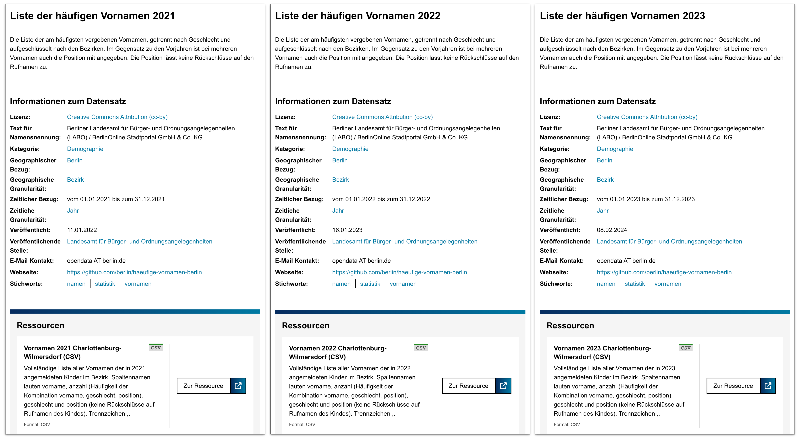

In Zukunft wird das Datenportal Funktionalität enthalten, mit der inhaltlich zusammenhängende Datensätze wie die Zeitreihe der Vornamensdaten auch explizit als Gruppe gekennzeichnet werden kann.
Es wird dann möglich sein, von einem Datensatz der Gruppe (z.&nbsp;B. _Liste der häufigen Vornamen 2015_) gleich zu allen anderen Datensätzen der Gruppe (_Liste der häufigen Vornamen 2012_, _&hellip; 2018_ etc.) zu gelangen.

### Weitere Informationen

Weitere Informationen zum Thema Datenformate können Sie z.&nbsp;B. in folgenden Quellen finden: [[OKI2019](#OKI2019)], [[EDP2019b](#EDP2019b)]

### Zusammenfassung

Die wichtigsten Punkte zum Thema Formatwahl hier noch einmal zusammengefasst:

- Das Format, in dem die Daten erstellt wurden, ist in vielen Fällen erste Wahl bei der Veröffentlichung.
Dies gilt selbst dann, wenn es nicht alle oben besprochenen Anforderungen erfüllt.
Die Vorteile sind: 
  - Die Veröffentlichung kann schnell erfolgen (wie gesetzlich vorgeschrieben).
  - Alle Details der Daten bleiben erhalten.
- Der Datensatz sollte schnellstmöglich um eine Datenressource in einem Format ergänzt werden, das alle Anforderungen an Offenheit und Maschinenlesbarkeit erfüllt.
- CSV ist ein offenes und maschinenlesbares Format, das darüberhinaus sehr einfach und verbreitet ist, und sich für viele Anwendungsfälle eignet.
- Unstrukturierte, nicht-maschinenlesbare Formate sollten nur als zusätzliche Dokumentation veröffentlicht werden, und nie allein stehen.
- Neben dem Format müssen auch die Werte selbst bei der Maschinenlesbarkeit beachtet werden. Die Formatierung sollte internationalen, in der IT üblichen Standards folgen.
- Nach Möglichkeit sollten eindeutige Bezeichner (Codes, Identifier etc.) in den Daten genutzt werden. Idealerweise können diese Codes als Linked Data aufgelöst werden.


## <a name="lizenzen">Lizenz festlegen</a>

Die Bedingungen, unter welchen veröffentlichte Datensätze oder Dokumente genutzt werden können, werden durch Nutzungsbestimmungen (Lizenzen) festgelegt.
Welche Lizenz für ihre Datensätze gelten soll, entscheiden dabei Sie als Datenbereitsteller.

In das Open Data-Portal können nur Datensätze und Dokumente mit klaren, eindeutigen Nutzungsbestimmungen aufgenommen werden.
Während des Schritts [_Datenmonitoring_](#datenmonitoring) haben Sie bereits die Datensätze herausgefiltert, zu welchen Sie die Rechte halten.
Stellen Sie die Daten anschließend unter eine geeignete Lizenz, die den Nutzern größtmöglichen Spielraum beim Umgang mit den Daten einräumt und den Anforderungen an Offenheit genügt.
Um den Open Data-Gedanken nicht zu gefährden, sollen die Nutzungsbestimmungen die weitere kommerzielle und nichtkommerzielle Nutzung der veröffentlichten Daten möglichst wenig einschränken.
Auch hier gibt die Rechtsverordnung zu [§13 EGovG Bln](http://gesetze.berlin.de/jportal/portal/t/lkc/page/bsbeprod.psml?pid=Dokumentanzeige&showdoccase=1&js_peid=Trefferliste&documentnumber=1&numberofresults=1&fromdoctodoc=yes&doc.id=jlr-EGovGBEpP13#focuspoint) näher Auskunft.
Bei der Entscheidung, ob eine Lizenz als „offen“ einzustufen ist, kann die [Open Definition](https://opendefinition.org/od/2.0/de/) von [Open Knowledge International](https://okfn.org) hinzugezogen werden.

Momentan stehen folgende Lizenzen in den verschiedenen Veröffentlichungswegen zur Verfügung:

- [CC0 1.0:  Creative Commons Universell Public Domain Dedication](https://creativecommons.org/publicdomain/zero/1.0/deed.de)
- [CC BY 4.0: Creative Commons Namensnennung 4.0 International](https://creativecommons.org/licenses/by/4.0/deed.de)
- [CC BY-SA 4.0: Creative Commons Namensnennung – Weitergabe unter gleichen Bedingungen 4.0 International](https://creativecommons.org/licenses/by-sa/4.0/deed.de)
- [CC BY-NC 4.0: Creative Commons Namensnennung-Nicht kommerziell 4.0 International](https://creativecommons.org/licenses/by-nc/4.0/deed.de)
- [Datenlizenz Deutschland – Zero – Version 2.0](https://www.govdata.de/dl-de/zero-2-0)
- [Datenlizenz Deutschland – Namensnennung – Version 2.0](https://www.govdata.de/dl-de/by-2-0)
- [GeoNutzV (19.03.2013)](https://www.gesetze-im-internet.de/geonutzv/BJNR054700013.html)
- [GeoNutzV-Berlin](https://www.stadtentwicklung.berlin.de/geoinformation/download/nutzIII.pdf)
- [ODbL: ODC Open Database License](https://opendatacommons.org/licenses/odbl/summary/)

Es sollte nach Möglichkeit immer die aktuelle Version einer Lizenz gewählt werden. In begründeten Ausnahmen kann auch eine ältere Version einer Lizenz genutzt werden.

Exemplarisch werden im Folgenden drei unterschiedliche Lizenzen vorgestellt.
Diese Zusammenfassungen sollen als Einführung dienen.
Sie ersetzen nicht eine genaue Auseinandersetzung mit den tatsächlichen Lizenztexten.

### Creative Commons Namensnennung

Die Lizenz _Creative Commons Namensnennung 4.0 International_ (CC BY 4.0) ist eine international bekannte und weit verbreiteten Lizenz für schöpferische Werke.
Dies umfasst etwa Texte, Musikstücke, Bilder oder Videos und – insbesondere seit der Version 4.0 – auch Datenbanken.

In ihrer _BY_-Ausprägung ist die Datennutzung entgeltfrei unter Nennung der Datenquelle für nicht-kommerzielle ebenso wie für kommerzielle Zwecke zulässig.
CC-Lizenzen können von den Berliner Behörden unmittelbar verwendet werden.
Ihre Anwendung wird wegen der hohen Bekanntheit und Akzeptanz empfohlen.

In Version 4.0 werden explizit auch Datenbanken (im weitesten Sinne, also auch Dateien) abgedeckt.
Zudem gibt es nun einen international einheitlichen Lizenztext für jede Lizenz, der lediglich in verschiedenen Übersetzungen angeboten wird.
Dies ist eine Neuerung gegenüber Version 3.0, in der noch Anpassungen der Lizenztexte an verschiedene Rechtsräume (etwa den deutschen) gemacht wurden.
Weitere Informationen finden Sie unter <https://creativecommons.org/licenses/by/4.0/>.

### Datenlizenz Deutschland – Namensnennung

Im Rahmen der Bund-Länder-Arbeitsgruppe _Open Government_ wurde für die Datenbereitstellung auf dem Datenportal für Deutschland GOVDATA die _Datenlizenz Deutschland_ entwickelt, die mittlerweile in der stark überarbeiteten Version 2.0 vorliegt.
Die Nutzungsbestimmungen sind in kurzer, übersichtlicher und leicht verständlicher Form dargestellt.
Die Datennutzung ist entgeltfrei unter Nennung der Datenquelle sowohl für nicht-kommerzielle wie kommerzielle Zwecke zulässig.
Die Nutzungsbestimmungen beziehen sich allgemein auf die Nutzung von Daten (Geodaten sind nicht gesondert genannt) und werden auf Bundesebene wegen ihres Bezugs zum deutschen Rechtsraum als einfachste und sicherste Variante für die Verwaltung angesehen.
Ihr Nachteil ist der geringe Bekanntheitsgrad in der Öffentlichkeit.
Weitere Informationen finden Sie unter <https://www.govdata.de/lizenzen>.

### Geodatennutzungsverordnung

Die _Verordnung zur Festlegung der Nutzungsbestimmungen für die Bereitstellung von Geodaten des Bundes_ (GeoNutzV) vom 19. März 2013 (BGBl. I S. 547) gilt formell nur für die geodatenhaltenden Stellen des Bundes und der bundesunmittelbaren juristischen Personen des öffentlichen Rechts in Bezug auf Geodaten, Geodatendienste sowie dazugehörige Metadaten.
Die Nutzungsbestimmungen sind in kurzer, übersichtlicher und leicht verständlicher Form dargestellt.
Sie lassen auch die kommerzielle Nutzung zu.

Für das Land Berlin wurde eine angepasste Form der GeoNutzV durch die Senatsverwaltung für Stadtentwicklung und Wohnen (ehemals Stadtentwicklung und Umwelt) veröffentlicht.
Diese berlinspezifischen Nutzungsbestimmungen wurden im Juni 2019 allerdings durch die _Datenlizenz Deutschland – Namensnennung_ (Version 2.0) ersetzt, um so einen Beitrag zur Vereinheitlichung des Lizenzwesens zu leisten.

# <a name="wege_der_veroeffentlichung">Wege der Veröffentlichung</a>

Es gibt verschiedene Möglichkeiten, offene Daten im Berliner Datenportal zu veröffentlichen. Je nach Situation und Ausgangslage in Ihrer Behörde sind diese besser oder schlechter für Sie geeignet. 
Die folgende Grafik (s. Abbildung) kann bei der Auswahl des Weges als grobe Entscheidungshilfe dienen. 
Im Anschluss werden die einzelnen Veröffentlichungswege detailliert vorgestellt.


## Grundsätzliches

Obwohl sich alle Veröffentlichungswege in ihren Details unterscheiden, gibt es einige Aspekte, die allen gemeinsam sind.

- **Zeitliche Verzögerung**: Mit der Speicherung bzw. Freischaltung eines neuen Datensatzes oder einer Änderung im Eingabesystem (Imperia, Datenregister etc.), ist der Datensatz nicht unmittelbar im Datenportal auf daten.berlin.de zu sehen. Das liegt daran, dass das Datenportal in regelmäßigen Abständen (aktuell stündlich) das Datenregister nach Änderung und neuen Datensätzen abfragt und diese erst anschließend importiert und sichtbar macht. Weitere Verzögerungen könen auftreten, wenn mehrere Systeme hintereinandergeschaltet sind (z.&nbsp;B. Imperia Datenrubrik → Datenregister → Datenportal).
- **Ankündigung neuer Datensätze**: Das Berliner Datenportal verfügt über einen eigenen Twitter-Account [\@OpenDataBerlin](https://twitter.com/OpenDataBerlin), auf dem neue Datensätze automatisch angekündigt werden, sobald Sie vom Datenportal importiert wurden (s. Abbildung).

{:width="500px"}{: .centered }

## <a name="datenrubrik">Imperia Datenrubrik</a>

Wählen Sie diesen Weg wenn:

* Sie einzelne Datensätze manuell veröffentlichen wollen.
* Ihre Datenressource bisher noch nicht online verfügbar ist.
* Ihre Behörde einen Imperia-Auftritt hat.
* Sie den Datensatz unabhängig von den redaktionellen Seiten ihres Imperia-Auftritts veröffentlichen wollen.

Die Datenrubrik ermöglicht es, Datensätze unabhängig von redaktionellen Seiten in ihrem Imperia-Auftritt zu veröffentlichen (s. Abbildung). 
Zum Anlegen eines Datensatzes müssen die [Metadaten](#metadaten) in ein Formular eingegeben und dann mit der eigentlichen Datenressource verknüpft werden.
Dazu kann entweder eine Datei hochgeladen werden, oder eine bereits online verfügbare Ressource (File oder API) verlinkt werden.
Schließlich wird der Datensatz automatisch ans Datenportal übergeben und kann dann dort gefunden werden.
Alle so erzeugten Datensätze erscheinen außerdem gesammelt in einer alphabetischen Liste in einem gesonderten Bereich Ihres Imperia-Auftritts, evtl. gegliedert nach Unterkategorien.
Für jeden Datensatz wird dort ein Link aufgeführt, der die Nutzer zu der entsprechenden Seite im Datenportal führt.

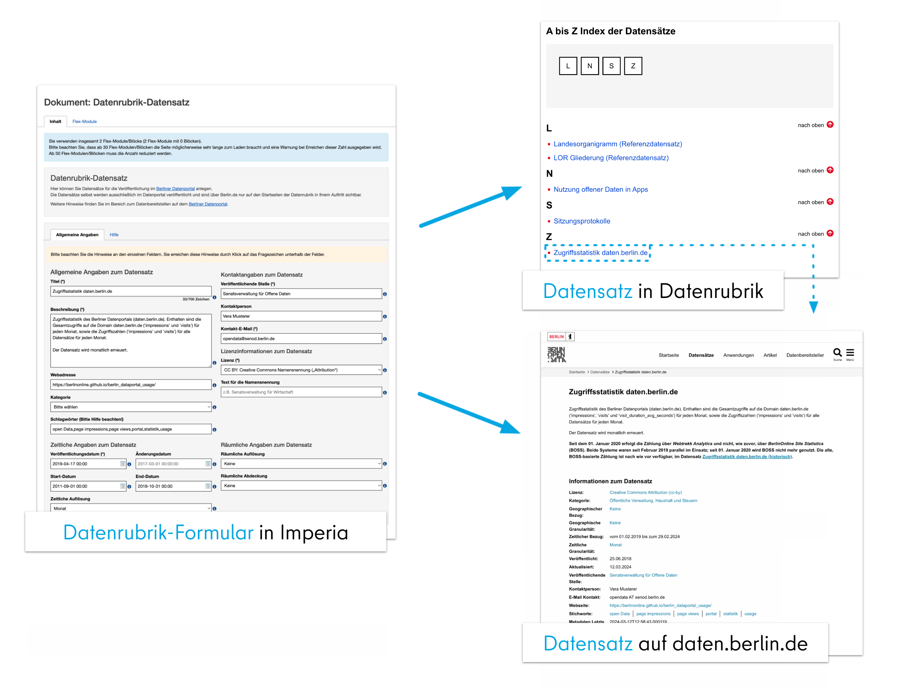

Die aktuelle [Dokumentation zur Datenrubrik](https://support.berlin.de/wiki/Datenrubrik_für_die_Veröffentlichung_im_Berliner_Datenportal) finden Sie im Imperia Support Wiki. Im Folgenden werden die wichtigsten Aspekte zusammenfassend wiedergegeben.

### Datenrubrik einrichten

Bevor die Datenrubrik genutzt werden kann, muss sie für Ihren Imperia-Auftritt angelegt werden.
Es ist nur eine Rubrik pro Imperia-Hauptauftritt möglich. Weitere Unterrubriken zur Sortierung können redaktionell angelegt werden. Bei den Senatsverwaltungen sollten die Rubriken in den jeweiligen Abteilungen (z.&nbsp;B. _Arbeit_ oder _Wirtschaft_) und nicht in den Dachauftritten der aktuellen Zusammenschnitte angelegt werden.
Dadurch ist die Verfügbarkeit der Daten auch gewährleistet, wenn sich die Organisationsstruktur von Senatsverwaltungen z.&nbsp;B. durch eine Senatsumbildung ändert.

Das Anlegen der Datenrubrik erfolgt einmalig für jeden Imperia-Hauptauftritt, und kann nur durch den [berlin.de-Support](mailto:support@berlin.de?CC=landesredaktion@berlin.de&subject=Datenrubrik%20einrichten) durchgeführt werden (Ihre E-Mail wird ebenfalls an die Landesredaktion zur Information verschickt.
Eine Genehmigung durch die Landesredaktion ist nicht erforderlich).
Der Name der Datenrubrik lautet einheitlich _Daten_ und wird unter der Rubrik _Service_ angelegt.
Wenn diese Rubrik nicht vorhanden ist, kann eine andere gewählt werden.
Die Einrichtung kann nur vom hauptverantwortlichen Imperia-Redakteur (_CvD_) angestoßen werden.

### Datensatz anlegen

Um einen Datensatz anzulegen, können Sie über den Rubrikenbaum Ihres Auftritts die Datenrubrik auswählen und dort ein neues Dokument erstellen (s. Abbildung).

{:width="400px"}{: .centered }

Im folgenden Schritt wählen Sie das Template _Datenrubrik-Datensatz_ aus und vergeben einen Titel. Dann gelangen sie zum Datensatz-Template (s. Abbildung).

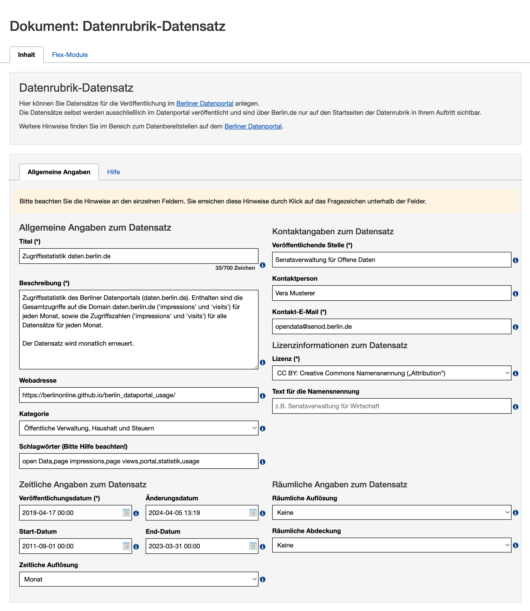

Das Formular gleicht im Wesentlichen dem entsprechenden [Formular im Datenregister](#datenregister_datensatz_anlegen). Pflichtfelder sind mit einem Asterisk markiert; außerdem ist für alle Felder auch im Formular selbt die Dokumentation über die `i`-Links verfügbar.

Die Bedeutung der einzelnen Metadaten-Felder ist im Abschnitt [Metadaten](#metadaten) beschrieben. An dieser Stelle sind lediglich zusätzliche Informationen aufgeführt, die sich auf den Kontext der Datenrubrik beziehen:

- **Webadresse**: Dieses Feld beinhaltet eigentlich die Adresse, unter der weitere Informationen zum Datensatz abgerufen werden können.
Für Datensätze, die über die Datenrubrik in das Berliner Datenportal eingepflegt werden, muss dieses Feld daher in der Regel nicht befüllt werden, da hier Datensätze veröffentlicht werden, die nicht mit einer redaktionellen Webseite in Verbindung stehen. 
Es ist aber vorstellbar, dass es dennoch weitere Informationen zu den Daten auf einer behördlichen Seite gibt. Deren URL kann im Feld Webadresse hinterlegt werden.
- **Kategorie**: Die Kategorie bestimmt, wie der Datensatz im Datenportal thematisch eingegliedert wird. 
Bitte beachten Sie, dass übergangsweise innerhalb der Datenrubrik weniger Kategorien zur Verfügung stehen, als im Datenportal verfügbar sind.
Das liegt daran, dass mit der Umstellung auf das neue Meta-Datenschema DCAT-AP.de auch die Kategorien im Berliner Datenportal daran angeglichen werden.
Nicht für alle alten Kategorien gibt es eine Entsprechung in DCAT-AP.de.
Für alle neuen Datensätze gilt daher, dass Kategorien, die in DCAT-AP.de nicht enthalten sind, hier auch nicht mehr angeboten werden.<br/>
Bitte wählen Sie daher die für Ihren Datensatz am ehesten passende Kategorie und ergänzen Sie weitere Merkmale in Form von Schlagwörtern.

### Datenressourcen hinzufügen

Im Bereich _Datenrubrik-Ressourcen_ können Sie Dateien oder Verlinkungen zum Datensatz hinzufügen.
Datensätze müssen mindestens eine Ressource enthalten.
Die Ressource beinhaltet die eigentlichen Daten und sollte daher in einem [maschinenlesbaren Format](#formatwahl) oder in Form einer URL zu einer Schnittstelle hinterlegt werden.
Sie können beliebig viele Ressourcen hinzufügen.

Auch für die Datenressource selbst müssen einige wenige Metadaten angegeben werden.
Im Einzelnen werden diese im Abschnitt [Metadaten der Datenressource](#metadaten-der-datenressource) beschrieben.

Das Hinzufügen von Ressourcen geschieht über Flexmodule. Bitte nutzen Sie pro Ressource ein Flexmodul. Folgende Flexmodule stehen zur Verfügung:

**Ressource: Download**

Nutzen Sie dieses Modul, wenn Sie Ressourcen hinzufügen möchten, die innerhalb des _Media-Asset-Managements_ (MAM) von Imperia liegen. Sie können darüber Dateien hochladen und als Ressource bereitstellen (s. Abbildung).


In der Beschreibung können Sie Informationen und Hinweise zur Nutzung der Daten hinterlegen.
Über die Auswahl der Sprache ist es auch möglich, Ressourcen in unterschiedlichen Sprachen beim Datensatz zu hinterlegen.

**Ressource: ext. Verlinkung**

Nutzen Sie dieses Modul, wenn Sie eine externe Quelle, z.&nbsp;B. eine Schnittstelle als Ressource hinzufügen möchten (s. Abbildung).

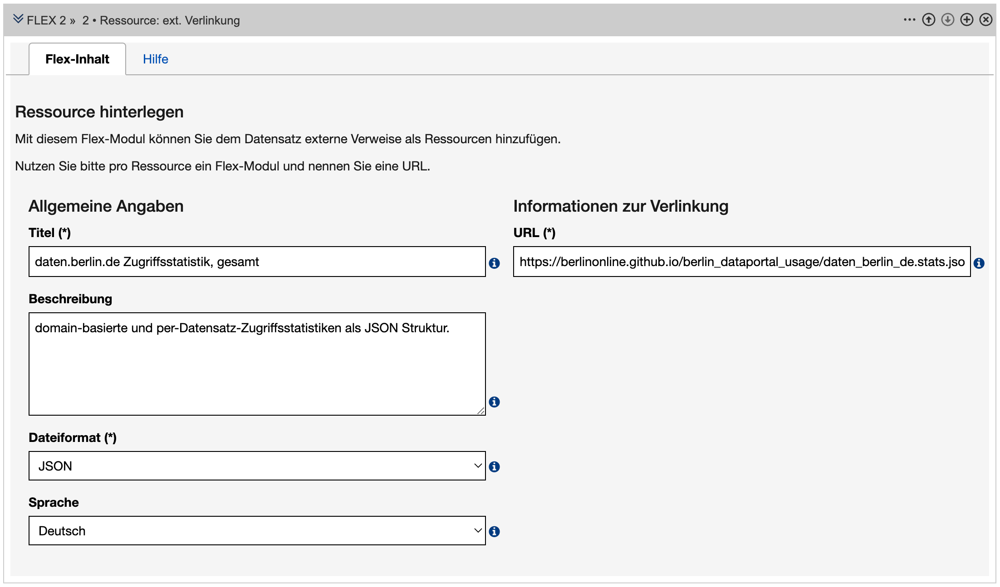

### Startseite

Auf der Datenrubrik-Startseite werden alle Datensätze angezeigt, die in dieser Rubrik angelegt wurden.
Die Datensätze erscheinen automatisch in einer A–Z-Liste. 
Zusätzlich können Sie ein Einleitungsbild und einen Einleitungstext hinzufügen, die oberhalb der A–Z-Liste angezeigt werden (s. Abbildung).

Bitte beachten Sie, dass auf der Startseite nur Datensätze angezeigt werden, die über den Veröffentlichungsweg _Datenrubrik_ erstellt wurden.
Datensätze aus anderen Veröffentlichungswegen erscheinen hier nicht.


In der A-Z-Liste werden alle Datensätze aus allen Rubriken angezeigt.
Wenn Sie nur Datensätze einzelner Rubriken und gegebenenfalls deren Unterrubriken sehen möchten, können Sie in dieser Rubrik ebenfalls eine Datenrubrik-Startseite anlegen.

Die Datensätze verlinken direkt ins Datenportal.
Bitte beachten Sie, dass lediglich Datensätze angezeigt werden, die bereits freigeschaltet sind.
Bei neu freigeschalteten Datensätzen kann es bis zu 60 Minuten dauern, bis diese im Datenportal zur Verfügung stehen.

## <a name="simplesearch">Imperia SimpleSearch</a>

Wählen Sie diesen Weg wenn:

* Sie einzelne Datensätze manuell veröffentlichen wollen.
* Sie einen Imperia-Zugang haben.
* Ihre Daten tabellarische Form (CSV) haben.
* Sie eine Datenbankanwendung im Imperia-Auftritt Ihrer Verwaltung erstellen wollen.

Mit dem Imperia SimpleSearch-Baukasten können Sie einfache Datenbankanwendungen im Imperia-Auftritt Ihrer Verwaltung erstellen (s. Abbildung).
Vorraussetzung sind Daten in tabellarischer Form (als CSV-Datei).
Um aus der SimpleSearch-Anwendung zusätzlich auch einen Datensatz im Datenportal zu machen, müssen Sie lediglich die entsprechende Option aktivieren und die relevanten [Metadaten](#metadaten) in ein Formular eingeben.
Ihre Daten sind dann in verschiedenen Formaten (CSV, JSON, XML und evtl. andere) online verfügbar und werden als Datensatz im Datenportal veröffentlicht.

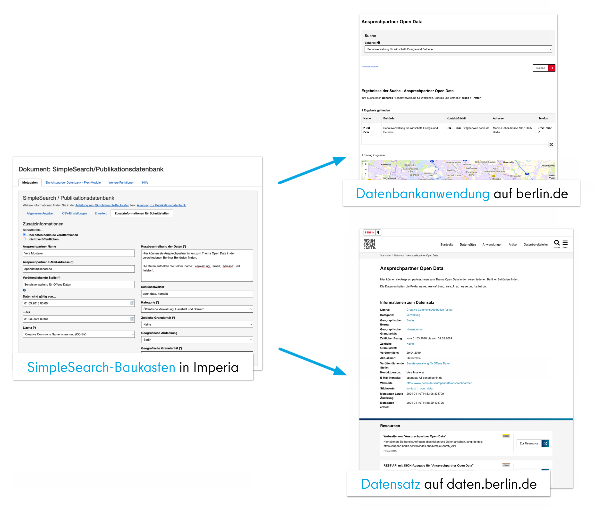

### Datensatz aus SimpleSearch-Anwendung erzeugen

Die Details zum Erstellen einer SimpleSearch-Anwendung würden den Rahmen dieses Dokuments sprengen.
Eine detaillierte Dokumentation zu diesem Thema finden Sie im [Imperia Support Wiki](https://support.berlin.de/wiki/SimpleSearch-Baukasten).
An dieser Stelle soll nur kurz erläutert werden, welche Schritte nötig sind, um aus einer bestehenden SimpleSearch-Anwendung einen Datensatz für das Datenportal zu erzeugen.

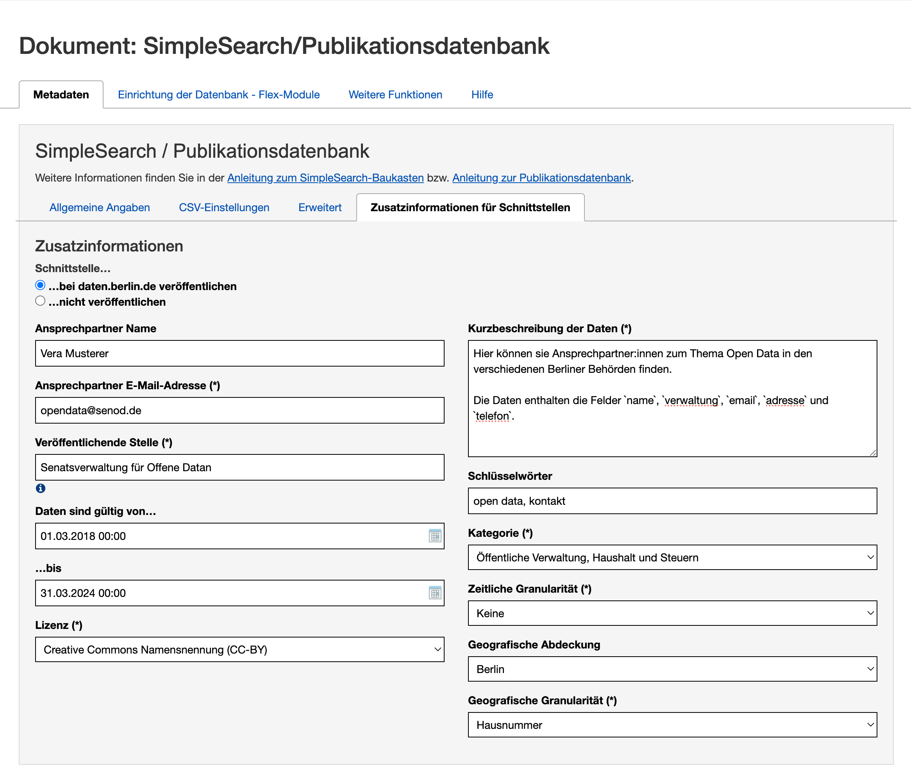

- Wählen Sie zunächst den Unterreiter _Zusatzinformationen für Schnittstellen_ im Reiter _Metadaten_ des SimpleSearch-Baukastens aus (s. Abbildung).
- Stellen Sie sicher, dass bei _Schnittstelle&hellip;_ die Auswahl _&hellip; bei daten.berlin.de veröffentlichen_ aktiviert ist.
- In den weiteren Formularfeldern bestimmen Sie die Metadaten Ihres Datensatzes. Für den Titel des Datensatzes wird der Titel aus dem Reiter _Allgemeine Angaben_ übernommen.
- Füllen Sie die Informationen in den weiteren Formularfeldern aus. Details zur Bedeutung der einzelnen Felder finden Sie im Kapitel _[Metadaten](#metadaten)_.
- Wie oben erwähnt, erlaubt die SimpleSearch API den Export der Daten in verschiedenen Formaten (welche Formate dies sind, definieren Sie im Reiter _Erweitert_). Im Zuge der Veröffentlichung des Datensatzes im Datenportal wird dort für jedes Format eine Datenressource angelegt.
- Nach dem Freischalten Ihrer Anwendung wird der Datensatz im Datenportal veröffentlicht. Es kann bis zu einer Stunde dauern, bis der Datensatz dort zu sehen ist, da der Veröffentlichungsprozess über mehrere Systeme erfolgt, die in regelmäßigen Abständen aufeinander zugreifen (siehe [_Das Berliner Datenportal_](#datenportal)).

## <a name="datenregister_manuell">Datenregister manuell</a>

Wählen Sie diesen Weg wenn:

* Sie einzelne Datensätze manuell veröffentlichen wollen.
* Ihre Datenressourcen bereits online verfügbar sind.
* Eine Veröffentlichung über die Imperia Datenrubrik oder als SimpleSearch-Anwendung nicht möglich oder erwünscht ist.

Unabhängig vom Veröffentlichungsweg gelangen letztendlich alle Datensätze ins Datenregister, und von dort aus ins Datenportal.
Falls kein Imperia-Zugang vorhanden ist und automatisierte Wege wie der CKAN Harvester oder ein Upload über die CKAN API nicht in Frage kommen, besteht auch die Möglichkeit, Datensätze direkt im Datenregister anzulegen.

### Benutzerkonto

Das Datenregister ist nicht-öffentlich.
Vorraussetzung für die Nutzung ist daher, dass Sie über ein Benutzerkonto verfügen (das Benutzerkonto ist unabhängig von Ihrem Imperia-Zugang).
Um ein Benutzerkonto zu beantragen und zu aktivieren, gehen Sie folgendermaßen vor:

- Beantragen Sie das Benutzerkonto per E-Mail an opendata@berlin.de, Betreff „Zugang Datenregister {NAME}“. Geben Sie dabei Ihren vollen Namen und zugehörige Organisation (Verwaltung, Abteilung etc.) an. Das Benutzerkonto ist personalisiert.
- Wenn mehrere Zugänge beantragt werden, muss für jede Person eine gültige E-Mail-Adresse angegeben werden.
- Sobald Ihr Antrag bearbeitet ist, erhalten Sie eine E-Mail mit Ihrem Benutzernamen.
- Öffnen Sie die Seite <https://datenregister.berlin.de/user/reset>.
- Geben Sie Ihren Benutzernamen ein und klicken Sie _Zurücksetzen anfordern_ (s. Abbildung).
- Sie erhalten eine E-Mail mit einem Link. Öffnen Sie diesen und geben Sie Ihr gewünschtes Passwort ein (s. Abbildung).
- Zum Einloggen öffnen Sie die Seite <https://datenregister.berlin.de/user/login> und geben Ihren Benutzernamen und Passwort ein (s. Abbildung).

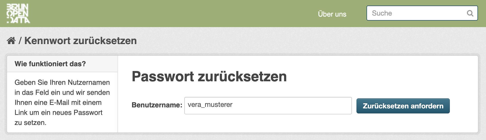

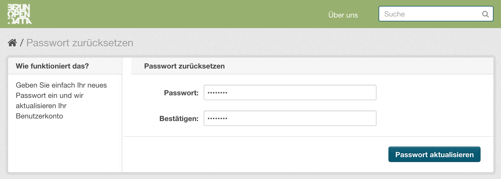

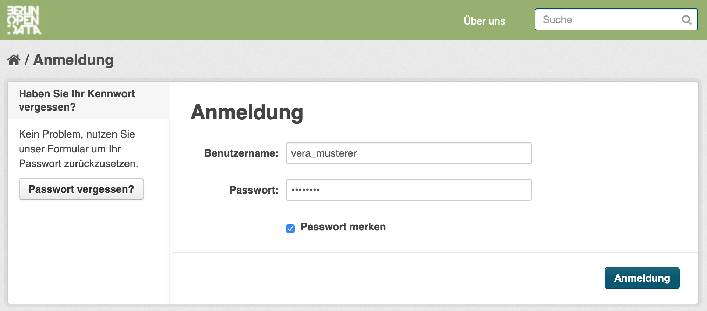

### Navigation

Sobald Sie eingeloggt sind, können Sie die Funktionen des Datenregisters nutzen (s. Abbildung).

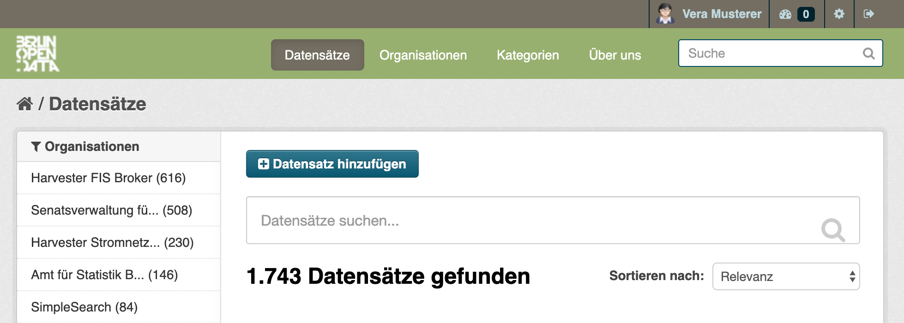

#### Nutzermenü

Im Nutzermenü am oberen Rand des Fensters können Sie auf Funktionen des Datenregisters zugreifen, die Ihr Benutzerkonto betreffen.
Sie können etwa Ihr [Nutzerprofil](#nutzerprofil) einsehen und ändern, Ihr persönliches [Dashboard](#dashboard) aufrufen oder sich nach getaner Arbeit wieder ausloggen.

#### Hauptmenü

Unter dem Nutzermenü befindet sich das Hauptmenü des Datenregisters.
Hier können Sie nach Datensätzen suchen sowie in die verschiedenen Hauptbereiche des Datenregisters navigieren:

- **Datensätze:** Hier gelangen Sie zur Liste aller Datensätze, die sich über das Suchfeld und die Filterfunktionen auf der linken Seite einschränken lässt.
An dieser Stelle finden Sie auch die Möglichkeit, einen neuen [Datensatz hinzuzufügen](#datensatz-anlegen).

- **Organisationen:** Über diesen Menüpunkt kommen Sie zur Liste aller [Organisationen](#organisationen) im Datenregister.
Wählt man eine Organisation aus, gelangt man zur Liste der Datensätze dieser Organisation.

- **Kategorien:** Jeder Datensatz im Datenregister ist einer inhaltlichen Kategorie zugeordnet.
Hier können Sie eine Liste aller Kategorien aufrufen.
Wählt man eine Kategorie aus, gelangt man zur Liste der Datensätze in dieser Kategorie.

- **Über uns:** Dies ist das Impressum (und die einzige öffentliche Seite) des Datenregisters.

### Dashboard

Das Dashboard bietet einen Nachrichtenfeed, der Ereignisse von Objekten anzeigt, denen Sie folgen (s. Abbildung).

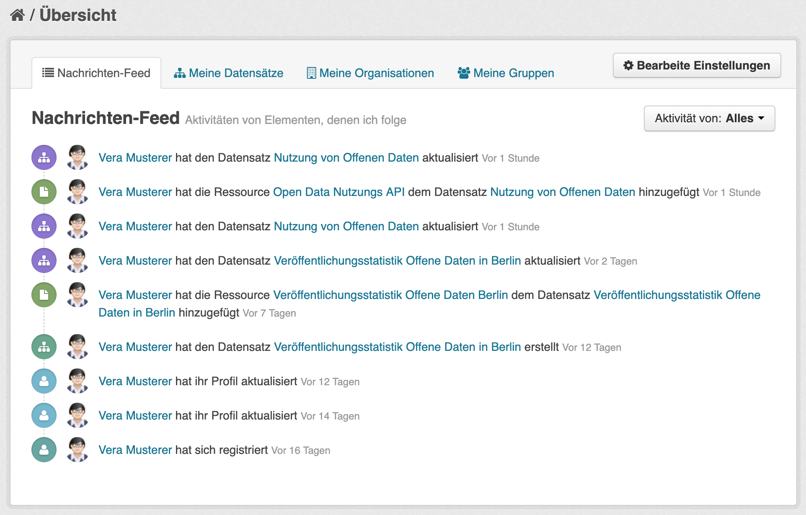

Sie können z.&nbsp;B. Organisationen oder Kategorien folgen und erfahren dann über das Dashboard, wenn neue Datensätze hinzugefügt oder bestehende geändert wurden.
Sie können auch einzelnen Datensätzen folgen.
Um etwa einer Kategorie zu folgen, öffnen Sie deren Seite über den _Kategorien_-Reiter im Hauptmenü und klicken Sie dann den _Folgen_ Button (s. Abbildung).

{:width="300px"}{: .centered }

Sie öffnen das Dashboard entweder über das [Nutzermenü](#nutzermenu) oder direkt über den Link <https://datenregister.berlin.de/dashboard>. 
Auf ihrer Profilseite haben Sie außerdem die Möglichkeit, eine E-Mail-Benachrichtigung über neue Ereignisse auf Ihrem Dashboard zu abonnieren (unter _Bearbeiten_).

### Nutzerprofil

Im Nutzerprofil können Sie die Daten ansehen und bearbeiten, die das Datenregister zu Ihnen speichert (s. Abbildung).
Dazu gehören Name, E-Mail-Adresse und optional ein kurzer Beschreibungstext, etwa Ihre Position, weitere Kontaktdaten etc.
Außerdem ist hier ein Link zu der Organisation zu finden, der man bei der Erstellung des Nutzeraccounts zugeordnet wurde. 

Der API-Schlüssel wird benötigt, um die API des Datenregisters zu nutzen, spielt aber für die meisten Nutzer keine Rolle.

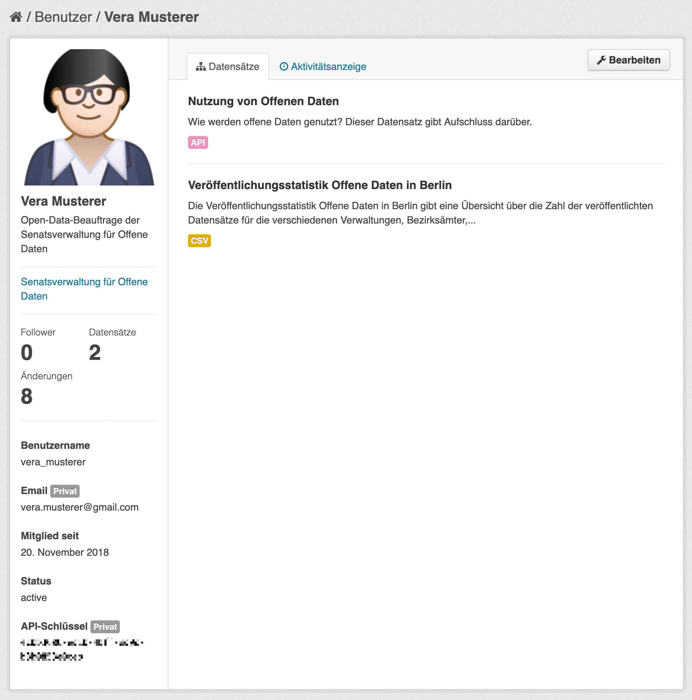

(Das Avatarbild wird übrigens nicht im Datenregister direkt gesetzt.
Stattdessen kann man über den Service gravatar.com ein Bild mit seiner E-Mail-Adresse verknüpfen, auf das das Datenregister dann zugreifen kann).

### Organisationen

Alle Datensätze und Nutzer im Datenregister sind einer **Organisation** zugeordnet.
Das Konzept der Organisation dient hauptsächlich der Steuerung der Zugriffsrechte im Datenregister: alle Mitglieder einer Organisation können Datensätze für diese (und nur diese) Organisation anlegen und bearbeiten.

Die Organisation eines Datensatzes ist nicht gleichzusetzen mit der [**Veröffentlichenden Stelle**](#metadaten-vö-stelle): 
in vielen Fällen stimmen beide Angaben zwar überein. 
Dies ist insbesondere dann so, wenn der Datensatz direkt manuell im Datenregister erstellt wurde.
Bei anderen Veröffentlichungswegen, z.&nbsp;B. [Imperia SimpleSearch](#simplesearch) oder [Datenrubrik](#datenrubrik), trifft dies jedoch nicht zu: hier bezeichnet die Organisation den jeweiligen Veröffentlichungsweg, also _SimpleSearch_ oder _Datenrubrik_.
Dies stellt sicher, dass Datensätze, die über diese Veröffentlichungswege in das Datenregister gelangen, auch nur auf diesem Wege geändert oder gelöscht werden können.

### <a name="datenregister_datensatz_anlegen">Datensatz anlegen</a>

Um einen neuen Datensatz im Datenregister anzulegen, klicken Sie im Bereich [_Datensätze_](https://datenregister.berlin.de/dataset) den Button [_Datensatz hinzufügen_](https://datenregister.berlin.de/dataset/new).
Auf diese Weise gelangen Sie zum Eingabeformular für einen neuen Datensatz (s. Abbildung).

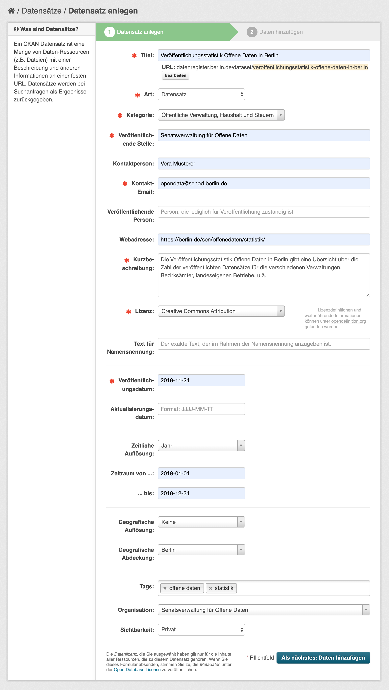{height=97%}

Im ersten Schritt geben Sie die allgemeinen Metadaten zu ihrem Datensatz ein. 
Zur Bedeutung der verschiedenen Metadatenfelder siehe auch das Kapitel [_Metadaten_](#metadaten).
Pflichtfelder sind rot markiert; alle anderen Felder sind optional.
Wenn Sie alle Metadaten eingegeben haben, gelangen Sie über den Button _Daten hinzufügen_ zum nächsten Schritt, in dem Sie die eigentlichen Datenressourcen hinzufügen.

### Datenressourcen hinzufügen

Damit Ihr Datensatz vollständig ist, müssen Sie ihm eine oder mehrere Datenressourcen hinzufügen (s. Abbildung).
Da Sie beim Anlegen des Datensatzes im Datenregister keine Datei hochladen können, verweisen Sie hier über das Feld _URL_ auf eine bereits online verfügbare Datenressource.


Angaben zur Bedeutung der anderen Metadatenfelder finden Sie im Kapitel [_Metadaten_](#metadaten).


## <a name="harvester">CKAN Harvester</a>

Wählen Sie diesen Weg wenn:

* Ihre Daten bereits online in einem anderen Datenportal verfügbar sind.
* Die Daten dort über eine gut dokumentierte API regelmäßig abgegriffen werden können.

Bei dieser Art der Veröffentlichung wird dem Datenregister ein sogenanntes **Harvester-Plugin** hinzugefügt, welches in regelmäßigen Abständen automatisch  neue oder geänderte Datensätze in einem bestehenden zweiten Datenportal abfragt.
Der Entwicklungsaufwand, der dazu betrieben werden muss, hängt dabei von der Art des Portals ab.
Sollten Sie Interesse an dieser Art der Veröffentlichung haben, kontaktieren Sie gerne opendata@berlin.de, um weitere Informationen zu erhalten.

## CKAN API

Wählen Sie diesen Weg wenn:

* Ihre Daten bereits online verfügbar sind.
* Sie große Mengen an Daten automatisch im Datenportal veröffentlichen wollen.
* Der Weg über einen CKAN Harvester nicht gangbar ist.

Bei dieser Art der Veröffentlichung setzt der Datenbereitsteller selbst auf eigenen Servern Software ein, die aus eigenen Datenbeständen JSON-Beschreibungen erzeugt und diese über die CKAN API des Datenregisters automatisch veröffentlicht.
Da dieser Veröffentlichungsweg spezialisierte Softwareentwicklung erfordert, die je nach Situation sehr unterschiedlich ausfallen kann, kann an dieser Stelle nicht weiter auf diesen Weg eingegangen werden.
Sollten Sie Interesse an dieser Art der Veröffentlichung haben, kontaktieren Sie gerne opendata@berlin.de, um weitere Informationen zu erhalten.

Als Einstiegspunkte zu weiterer Information dienen folgende Ressourcen:

* **Dokumentation der CKAN API**: Das Datenregister basiert auf der CKAN Software. Die CKAN API ermöglicht Lese- und Schreibzugriffe. <https://docs.ckan.org/en/latest/api/index.html>
* **Metadatenschema**: Die formale Definition des Metadatenschemas des Datenregisters, das bei der Kommunikation über die CKAN API befolgt werden muss. <https://datenregister.berlin.de/schema/>
* **Validierungs-API**: Neben der CKAN API verfügt das Datenregister auch über eine Validierungs API, über die die Werte einzelner Metadatenfelder auf ihre formale Richtigkeit hin überprüft werden können. <https://github.com/berlinonline/ckanext-validationapi>


# <a name="metadaten">Metadaten</a>

Dieser Abschnitt dokumentiert das Metadatenschema des Berliner Datenportals. Die Beschreibungen hier sind rein informativer Natur; verbindliche Definitionen (etwa für die Nutzung der CKAN API) gibt es jederzeit in aktuell gültiger Form unter <https://datenregister.berlin.de/schema>.

## Metadaten des Datensatzes

Anmerkung: Nicht alle Metadatenfelder kommen bei allen Veröffentlichungswegen zum Einsatz; einige kommen etwa nur bei der direkten Nutzung des Datenregisters vor.

### Titel

Der Titel ist eine kurze, prägnante, aber informative Bezeichnung des Datensatzes. Um inhaltlich ähnliche Datensätze bei einer Auflistung schnell unterscheiden zu können, sollten schon im Titel folgende Angaben enthalten sein:

- geografischer/politischer Bezug („&hellip; des Landes Berlin“, „&hellip; des Bezirks Pankow“ etc.)
- zeitlicher Bezug („&hellip; 2017“, „&hellip; 2011–2016“ etc.)

### Art

Obwohl das Datenportal in erster Linie für strukturierte, maschinenlesbare Daten vorgesehen ist, können in einigen Fällen auch Dokumente (unstrukturierte Daten) veröffentlicht werden. Für diesen Fall kann über das _Art_-Feld zwischen _Datensatz_ und _Dokument_ unterschieden werden. 

### Kategorie

Die Auswahl der Kategorie ermöglicht eine grobe inhaltliche Einordnung des Datensatzes.
Das Berliner Metadatenschema wird derzeit an das bundesweit gültige Schema [DCAT-AP.de](https://dcat-ap.de) (bzw. das europaweit gültige DCAT-AP) angepasst.
Dabei ändert sich auch die Auswahl der möglichen Kategorien, da es im ursprünglichen Berliner Metadatenschema Kategorien gab, die keine Entsprechung zu einer Kategorie in DCAT-AP.de haben.
Insbesondere nicht-thematische Kategorien wie _Geodaten_, _Sonstiges_ oder _Protokolle_ wird es in Zukunft nicht mehr geben.

### <a name="metadaten-vö-stelle">Veröffentlichende Stelle</a>

Die Veröffentlichende Stelle ist gleichbedeutend mit „Datenbereitsteller“. Bitte geben Sie hier den korrekten Namen der Einrichtung an, die den Datensatz veröffentlicht.

Insbesondere sollten unterschiedliche Schreibweisen derselben Stelle vermieden werden.
Dieses Feld wird möglicherweise in Zukunft durch eine Auswahlliste ersetzt, um Einheitlichkeit und Auffindbarkeit zu verbessern.

### Kontaktperson
Die Kontaktperson kann inhaltliche Fragen zu einem Datensatz beantworten.
Hier sollte der Name einer Person eingetragen werden, z.&nbsp;B. „Vera Musterer“.
Es sollte darauf geachtet werden, dass diese Angabe immer aktuell gehalten wird.

### Kontakt-E-Mail

Das Feld _Kontakt-E-Mail_ beinhaltet entweder eine E-Mail-Adresse oder den Link auf ein Kontaktformular, über welches Nutzer\*innen bei Bedarf mit der veröffentlichenden Stelle in Kontakt treten können.
Es wird empfohlen, hier keine persönlichen E-Mail-Adressen einzutragen, sondern auf Funktionspostfächer zurückzugreifen, die unabhängig von konkreten Personen bearbeitet werden.

### Webadresse

Das Datenportal ist ein reines Metadatenportal: die eigentlichen Datenressourcen befinden sich an beliebigen anderen Orten im Internet.
Über das Feld _Webadresse_ kann auf eine Seite verwiesen werden, die als eigentlicher Einstiegsort zu den Daten dient. 

### Beschreibung

Die Beschreibung fasst die Inhalte Ihres Datensatzes mit wenigen Sätzen zusammen. Bitte füllen Sie dieses Feld unbedingt aus: Es erleichtert allen Benutzern einen schnellen Überblick über die von Ihnen bereitgestellten Daten.

Beantworten Sie bei der Beschreibung z.&nbsp;B. folgende Fragen:

- Um welchen Datensatz handelt es sich?
- Über welche Informationen gibt der Datensatz Auskunft?
- Auf welchen Ort und auf welche Zeit beziehen sich die Daten?
- Wer stellte diese Daten zur Verfügung?

### Lizenz

Die Lizenz bestimmt, zu welchen Bedingungen der Datensatz genutzt werden darf.
Generell gilt: Eine möglichst offene Lizenz, die die Nutzung der Daten ohne oder mit sehr wenigen Einschränkungen zulässt, regt am ehesten zur Weiternutzung an.
Im Umkehrschluss macht eine restriktive Lizenz die Nutzung unwahrscheinlicher und läuft dem Gedanken von offenen Daten zuwider.
Am problematischsten sind fehlende oder obskure Lizenzen, da potentielle Nutzer so verunsichert werden.
Siehe auch den ausführlicheren Abschnitt zu [Lizenzen](#lizenzen).

Damit die Frage nach der Lizenz nicht für jeden Datensatz neu entschieden werden muss, ist es sinnvoll, hier eine einheitliche Regelung für jeden Datenbereitsteller (Verwaltung, Bezirksamt etc.) festzulegen. 

### Text für Namensnennung

Diese Angabe gibt präzise den Text an, den Nutzer\*innen bei Verwendung der Daten als Namensnennung angeben müssen, sofern die ausgewählte Lizenz das vorsieht (etwa bei Nutzung von CC-BY Lizenzen, der _Datenlizenz Deutschland – Namensnennung_ und anderer).
Oftmals entspricht diese Angabe der [Veröffentlichenden Stelle](#metadaten-vö-stelle).

### Veröffentlichungsdatum

Dieses Datum bezeichnet den Zeitpunkt der erstmaligen Veröffentlichung der eigentlichen Daten.
Dies bezieht sich nicht auf den Eintrag im Datenregister – wenn die Daten bereits früher auf anderem Wege (analog oder digital) veröffentlicht wurden, kann das Veröffentlichungsdatum auch früher liegen.
Der Veröffentlichungszeitpunkt im Datenregister wird automatisch vermerkt.

### Aktualisierungsdatum

Dieses Datum bezeichnet den Zeitpunkt der letzten Änderung der Daten.
Auch diese Angabe bezieht sich auf die eigentlichen Daten, nicht auf den Eintrag im Datenregister. Die Aktualisierungszeitpunkt im Datenregister wird automatisch vermerkt.

### Zeitliche  Auflösung

Wie fein oder grob sind Ihre Daten zeitlich aufgelöst?
Die Skala der Granularität reicht von grob (5 Jahre, Jahr) bis zu sehr fein (Minuten, Sekunden).

### Zeitliche Abdeckung

Auf welchen Zeitraum beziehen sich Ihre Daten?
Falls es sich um einen Zeitpunkt (Stichtag o. ä.) handelt, so geben Sie einen Zeitraum mit identischem Anfangs- und Enddatum an.

### Geographische Auflösung

Wie fein oder grob sind Ihre Daten geographisch aufgelöst?
Werden Angaben über das Land als Ganzes gemacht, oder sind die Daten nach Bezirken, Bezirksregionen etc. aufgeschlüsselt?
Wird vielleicht sogar auf präzise GPS-Koordinaten oder Hausadressen Bezug genommen?

### Geographische Abdeckung

Auf welches Gebiet beziehen sich die Daten?
Wird ganz Berlin abgedeckt, oder vielleicht nur ein bestimmter Bezirk, oder sogar nur eine bestimmte Bezirksregion?

### Tags

Schlüsselwörter, so genannte _Tags_, können frei vergeben werden.
Um eine hohe Auffindbarkeit Ihrer Daten sicherzustellen, ist die Angabe von mehreren prägnanten Tags empfohlen.
Diese können sich zum Beispiel beziehen auf:

- Übergeordnetes Thema
- Unteraspekte
- Gesetze und Richtlinien
- Themenbereiche (z.&nbsp;B. Spaltennamen Ihrer Datei)

Allerdings sollte man sich bei der Vergabe von Tags einschränken, um Widerholungen und Redundanz zu vermeiden. 
Nicht geeignet sind:

- Tags wie „Berlin“ oder „Open Data“, die für alle Datensätze im Datenportal gelten.
- Tags mit Zeit- und Ortsangaben („2017“, „Pankow“ etc.), da diese Information bereits über die Metadatenfelder zu geografischer und zeitlicher Abdeckung gegeben ist.
- Tags, die lediglich Titel oder Beschreibung wiedergeben.

### Organisation

Die Organisation ist nicht mit der [Veröffentlichenden Stelle](#metadaten-vö-stelle) zu verwechseln!
Bei dieser Angabe handelt es sich um ein internes Metadatum des Datenregisters: es regelt, welche Nutzer einen Datensatz bearbeiten dürfen.
Benutzer können hier nur die Organisation auswählen, der sie selbst angehören.
Genaueres ist dem Abschnitt [_Organisationen_](#organisationen) zu entnehmen. 

Im SimpleSearch-Baukasten und in der Datenrubrik ist dieses Metadatum nicht sichtbar (die Organisation wird automatisch gesetzt).

### Sichtbarkeit

Bei dem Feld _Sichtbarkeit_ kann zwischen _privat_ und _öffentlich_ unterschieden werden. Dieses Feld steht Ihnen bei der Veröffentlichung direkt im Datenregister zur Verfügung.
Die Angabe _privat_ bedeutet hier, dass der Datensatz noch nicht veröffentlicht werden soll.
Sobald _öffentlich_ eingestellt wurde, wird der Datensatz freigeschaltet und kann nach kurzer Zeit öffentlich auf [daten.berlin.de](https://daten.berlin.de) gefunden werden.

## Metadaten der Datenressource

Jede einzelne Datenressource bekommt zusätzlich einige gesonderte Metadaten. Bei der Veröffentlichung über den SimpleSearch-Baukasten müssen diese Angaben nicht gemacht werden, da die Ressourcen hier automatisch erstellt werden. 

### URL

Die URL ist die Adresse, unter der im Internet auf die Datenressource zugegriffen werden kann. Wird in der Datenrubrik eine Datei hochgeladen, muss diese Angabe nicht gemacht werden (der Link wird automatisch gesetzt).

### Titel

Der Titel ist ein knapper, aussagekräftiger Titel für die Ressource. Oft tritt der Fall ein, dass ein Datensatz mehrere Ressourcen mit demselben Inhalt, aber in unterschiedlichen Formaten enthält. In solchen Situationen kann das Format als Teil des Titels hinzugefügt werden, um identische Titel zu vermeiden. Beispiel:

- _Vornamen 2018 Charlottenburg-Wilmersdorf (CSV)_
- _Vornamen 2018 Charlottenburg-Wilmersdorf (PDF)_

### Beschreibung

Mit der Beschreibung können Sie weitere Angaben zur Ressource machen.
Ein Beispiel wäre etwa eine Information zum Datenschema (z.&nbsp;B. Spaltennamen bei tabellarischen Daten).

### Format

Im Falle einer Datei ist diese Angabe der Formats in der Regel übereinstimmend mit der Dateieindung der Ressource (also `csv`, `json`, `xlsx` etc.).
Für eine API kann hier der Wert `API` angegeben werden.
Bei einigen Veröffentlichungswegen wird diese Angabe über eine Auswahlliste eingeschränkt.
Falls Ihnen hier ein Format fehlt, melden Sie sich bitte beim [berlin.de Support](https://support.berlin.de/wiki/Hilfe_und_Support).
Gegebenenfalls kann die Menge der zugelassenen Formate erweitert werden.
Wenn das nicht möglich ist, können Sie Ihre Datenressourcen auch in einem Archiv verpacken (ZIP oder ähnliches) und dieses anschließend hochladen.
In diesem Fall sollten Sie das eigentliche Format in der Beschreibung der Ressource angeben.


# <a name="schnittstellen">Schnittstellen</a>

Das Berliner Datenportal bietet zwei unterschiedliche APIs (Programmierschnittstellen), um es in automatisierte Prozesse einbinden zu können.
Als Datenbereitsteller müssen Sie mit der Funktionsweise der Schnittstellen im Detail nicht vertraut sein.
Um ein vollständiges Bild des Datenportals zu geben, wollen wir hier trotzdem beide kurz vorstellen.

## <a name="schnittstelle_ckan">CKAN API</a>

Das Datenregister, das für die Eingabe und Speicherung aller Datensätze zuständig ist, basiert auf der weit verbreiteten Software [CKAN](https://ckan.org) (_Comprehensive Knowledge Archive Network_).
CKAN bietet von Haus aus eine sogennante **API**, also eine Schnittstelle zur Programmierung von Anwendungen.
Mit dieser API lassen sich etwa das Erzeugen oder Modifizieren von Datensätzen steuern, oder die Inhalte des Datenregisters auslesen, ohne dass man dazu einen Browser öffnen muss.
Die CKAN API des Datenregisters ist so konfiguriert, dass bestimmte lesende Zugriffe (Liste aller Datensätze, Metadaten eines Datensatzes, Suche nach Datensätzen etc.) offen zugänglich sind, während andere Zugriffe (insbesondere alle schreibenden Zugriffe) ein Nutzerkonto mit den entsprechenden Rechten erfordern.

Die CKAN API wird beispielsweise von der Imperia Datenrubrik und dem Imperia SimpleSearch Modul zur Kommunikation mit dem Datenregister genutzt.
Ebenso können Verwaltungen, die große Mengen an Datensätzen automatisch ins Datenportal integrieren wollen, die CKAN API benutzen, um diesen Vorgang zu automatisieren.
Auch Nutzer*innen mit dem entsprechenden technischen Verständnis können die API nutzen, um etwa eine Suche oder Analyse zu den Inhalten des Datenportals durchzuführen, die über die Möglichkeiten der Web-Oberfläche hinausgeht.

### Beispiele

Die genaue Funktionsweise der CKAN API geht über den Umfang dieser Broschüre hinaus.
Die folgenden zwei Beispiele sollen lediglich einen Eindruck verschaffen.
Dazu wird jeweils die URL eines API-Befehls aufgerufen, woraufhin das Datenregister eine Antwort im JSON-Format zurücksendet (hier gekürzt wiedergegeben).
Zum Testen können die Beispiel-URLs im Browser eingegeben werden.

#### Befehl: `package_list`

**Bedeutung**: Liste aller Datensätze (_packages_)<br/>
**URL**: <https://datenregister.berlin.de/api/3/action/package_list><br/>
**Antwort**: 

```json
{
  "help": "https://datenregister.berlin.de/api/3/action/help_show?name=package_list",
  "success": true,
  "result": [
    "20-grune-hauptwege-koordinaten-fur-spazier-und-wanderstrecken-mit-einer-gesamtlange-von-ca-600k",
    "3eurticket",
    "abschlussbericht-der-ag-open-data-berlin",
    "adressen-berlin",
    ...
    "wohnraume-2014-lor-wms",
    "zu-erwartender-hochster-grundwasserstand-zehgw-umweltatlas-wms",
    "zugriffsstatistik-daten-berlin-de",
    "zuschusse-des-religions-und-weltanschauungsunterrichts"
  ]
}
```

#### Befehl: `package_show`

**Bedeutung**: Details (Metadaten) zum angegebenen Datensatz<br/>
**URL**: <https://datenregister.berlin.de/api/3/action/package_show?id=zugriffsstatistik-daten-berlin-de><br/>
**Antwort**: 

```json
{
  "help": "https://datenregister.berlin.de/api/3/action/help_show?name=package_show",
  "success": true,
  "result": {
    "name": "zugriffsstatistik-daten-berlin-de",
    "title": "Zugriffsstatistik daten.berlin.de",
    "date_released": "2018-06-25",
    "date_updated": "2019-01-01",
    "temporal_coverage_from": "2011-09-01",
    "temporal_coverage_to": "2018-12-31",
    "maintainer_email": "opendata@berlin.de",
    "author": "BerlinOnline Stadtportal GmbH & Co. KG",
    "license_id": "cc-by",
    "notes": "Zugriffsstatistik des Berliner Datenportals
      (daten.berlin.de). Enthalten sind die Gesamtzugriffe
      auf die Domain daten.berlin.de ('impressions' und
      'visits') für jeden Monat, sowie die Zugriffszahlen
      ('impressions' und 'visits') für alle Datensätze für
      jeden Monat.\r\n\r\nDer Datensatz wird monatlich
      erneuert.",
    "resources": [
      {
        "description": "Eine Zeile pro Monat, Spalten für 
          page impressions und page visits.",
        "name": "daten.berlin.de Zugriffsstatistik, 
          domain-basiert",
        "format": "CSV",
        "url": "https://daten.berlin.de/sites/default/files/data/berlin_dataportal_usage/daten_berlin_de.domain_stats.csv",
      },
      ...
    ],
    ...
  }
}
```

### Weitere Informationen

Folgende Links können als Einstiegspunkte für die weitere Beschäftigung mit des Themas CKAN API dienen.

- Eine detaillierte Anleitung zur Nutzung der CKAN API finden Sie als Teil der CKAN Dokumentation: <https://docs.ckan.org/en/latest/api>
- Das Metadatenschema, das zur Nutzung der API mit dem Datenregister benötigt wird, finden Sie unter: <https://datenregister.berlin.de/schema/>
- Das Datenregister erweitert die CKAN API mit einer API zur Validierung von Metadaten. Die Dokumentation dazu finden Sie unter: <https://github.com/berlinonline/ckanext-validationapi>

## <a name="schnittstelle_dcat">DCAT-AP.de</a>

CKAN ist Open Source-Software, weit verbreitet und kann als De-facto-Standard im Bereich Open Data-Portale angesehen werden.
Trotzdem ist die CKAN API eine proprietäre Schnittstelle, die nicht von allen Datenportalen unterstützt wird.
Um die Interoperabilität zwischen Datenportalen in Europa zu gewährleisten, wurde [DCAT-AP](https://joinup.ec.europa.eu/solution/dcat-application-profile-data-portals-europe) als europaweiter Standard definiert.
Alle Datenportale, die über die nationalen Portale letztendlich im [Europäischen Datenportal](https://www.europeandataportal.eu) aggregiert werden, sollen diesen Standard als Austauschformat implementieren.
Auf nationaler Ebene sind verschiedene Versionen des Standards definiert worden, die zwar kompatibel mit DCAT-AP sind, aber darüber hinaus gewisse nationale Besonderheiten berücksichtigen.
[DCAT-AP.de](https://www.dcat-ap.de) wurde dabei als deutsche Adaption von DCAT-AP entwickelt und wird seit 2018 vom Berliner Datenportal unterstützt.
DCAT-AP wiederum basiert auf dem internationalen W3C-Standard [DCAT](https://www.w3.org/TR/vocab-dcat/).

Eine zentrale Idee von DCAT-AP ist, die Metadaten des Datenportals als **Linked Data** bereitzustellen, um so die Daten aus allen Portalen integrierbar und vergleichbar zu machen.
Linked Data ist eine Technologie, mit deren Hilfe Daten leicht miteinander in Beziehung gebracht werden können – in diesem Fall die Metadaten aller öffentlichen europäischen Datenportale.
Die Grundidee von Linked Data ist es, jede in den Daten beschriebene Entität – ein Datenportal, ein Datensatz, eine Datenressource, eine Person, eine Organisation, ein Land, eine Stadt, eine thematische Kategorie etc. – mit einer URL zu versehen.
Diese URL kann im Browser oder anderweitig geöffnet werden, um weitere Informationen über die Entität zu bekommen. 
Alle Beziehungen zwischen Entitäten – ein Datenportal enthält Datensätze, Datensätze haben Datenressourcen, Personen sind Ansprechpartner für Datensätze, Städte befinden sich in Ländern etc. – werden mit der Beschreibungssprache [RDF](https://www.w3.org/TR/rdf11-concepts/) ausgedrückt.

Grundsätzlich kann DCAT-AP.de sowohl für Lese- als auch für Schreiboperationen von Daten aus einem Datenportal genutzt werden. Im Berliner Datenportal ist allerdings nur der lesende Zugriff freigeschaltet. Über diesen Weg greift das bundesweite Datenportal [govdata.de](https://govdata.de) auf die Metadaten des Berliner Datenportals zu. Die Schnittstelle steht aber auch allen anderen Nutzern zur Verfügung.

### Beispiele

Das Datenregister bietet zwei Endpunkte, um (Meta-)Daten im DCAT-AP.de-Format zu beziehen. Auch hier können die Beispiel-URLs zum Ausprobieren im Browser eingegeben werden. Die Antwort-Daten sind hier jeweils in gekürzter Form als [RDF im Turtle Format](https://www.w3.org/TR/turtle/) angegeben.

#### Endpunkt: Katalog

**Beschreibung**: Metadaten zum gesamten Datenportal beziehen; analog zum `package_list`-Befehl der CKAN-API. Im Gegensatz zu `package_list` sind die kompletten Metadaten jedes Datensatzes enthalten. Daher ist die Liste paginiert (100 Datensätze pro Seite).<br/>
**Endpunkt URL**: `https://datenregister.berlin.de/catalog.{format}`<br/>
**Beispiel URL**: <https://datenregister.berlin.de/catalog.ttl><br/>
**Antwort**: 

```turtle
@prefix dcat: <http://www.w3.org/ns/dcat#> .
@prefix dcatde: <http://dcat-ap.de/def/dcatde/> .
...

<https://datenregister.berlin.de/catalog.ttl?page=1>
    a hydra:PagedCollection ;
    hydra:firstPage
        "https://datenregister.berlin.de/catalog.ttl?page=1" ;
    hydra:lastPage
        "https://datenregister.berlin.de/catalog.ttl?page=18" ;
    hydra:nextPage
        "https://datenregister.berlin.de/catalog.ttl?page=2" ;
    hydra:itemsPerPage 100 ;
    hydra:totalItems 1708 .

<https://datenregister.berlin.de>
    a dcat:Catalog ;
    dct:language "de" ;
    dct:modified "2019-01-28T11:33:47.154520"^^xsd:dateTime ;
    dct:title "Datenregister Berlin" ;
    dcat:dataset 
        bln-dataset:d_0191f93c-2925-4da5-8ba8-d24bf6c9e504 ,
        bln-dataset:d_9bc0bdcb-1211-474e-a3a7-5991b0dc1539 ,
        bln-dataset:d_fb25520a-713c-4185-b445-8282ec344dc5 ,
        ... ;
    foaf:homepage <https://datenregister.berlin.de> .

bln-dataset:d_0191f93c-2925-4da5-8ba8-d24bf6c9e504
    a dcat:Dataset ;
    dct:description "Senatsdokumente der Senatsverwaltung für
        Finanzen von Berlin" ;
    dct:title "Senatsvorlagen der Senatsverwaltung für
        Finanzen" ;
    dcat:distribution
        bln-distrib:d_00b35ca4-0046-46d9-834a-fca7f44374a3 ,
        bln-distrib:d_03c01eab-f9d7-482a-b6d8-180f9146ca42 ,
    ... .

bln-dataset:d_9bc0bdcb-1211-474e-a3a7-5991b0dc1539
    a dcat:Dataset ;
    dct:description """Zugriffsstatistik des Berliner
        Datenportals (daten.berlin.de). Enthalten sind die
        Gesamtzugriffe auf die Domain daten.berlin.de 
        ('impressions' und 'visits') für jeden Monat, sowie 
        die Zugriffszahlen ('impressions' und 'visits') für
        alle Datensätze für jeden Monat.\r\n\r\nDer Datensatz
        wird monatlich erneuert.""" ;
    dct:title "Zugriffsstatistik daten.berlin.de" ;
    dcat:distribution 
        bln-distrib:d_b6fe190c-e91a-435a-84fb-371ab848ddc5 ,
        ... ;
    ...
    .

bln-dataset:d_fb25520a-713c-4185-b445-8282ec344dc5
    a dcat:Dataset ;
    dct:description """Welche Datensätze wurden im Berliner
        Portal für Offene Daten daten.berlin.de im Jahr 2018
        am häufigsten nachgefragt?\r\n\r\nAlle Daten und Code
        gibt es auch [auf Github](https://github.com/berlinonline/berlin-open-data-stats-2018).""" ;
    dct:title "Datenportal Jahresrückblick 2018" ;
    dcat:distribution
        bln-distrib:d_0183d2b6-477b-404e-8f9c-12ac4f37337f ,
        bln-distrib:d_100072f0-2428-426f-ad70-fb9e5f28740c ;
    ... .

...

```

#### Endpunkt: Datensatz

**Beschreibung**: Metadaten zu einem einzelnen Datensatz beziehen; analog zum `package_show`-Befehl der CKAN-API.<br/>
**Endpunkt URL**: `https://datenregister.berlin.de/dataset/{dataset-id}.{format}`<br/>
**Beispiel URL**: <https://datenregister.berlin.de/dataset/zugriffsstatistik-daten-berlin-de.ttl><br/>
**Antwort**: 

```turtle
@prefix dcat: <http://www.w3.org/ns/dcat#> .
@prefix dcatde: <http://dcat-ap.de/def/dcatde/> .
...

bln-dataset:d_9bc0bdcb-1211-474e-a3a7-5991b0dc1539 
    a dcat:Dataset ;
    dcatde:contributorID dcatde-contrib:berlinOpenData ;
    dcatde:legalbasisText "§ 13 E-Government-Gesetz Berlin
        (EGovG Bln)" ;
    dct:conformsTo <http://dcat-ap.de/def/dcatde/1.0.1/> ;
    dct:description """Zugriffsstatistik des Berliner
        Datenportals (daten.berlin.de). Enthalten sind die
        Gesamtzugriffe auf die Domain daten.berlin.de
        ('impressions' und 'visits') für jeden Monat, sowie die
        Zugriffszahlen ('impressions' und 'visits') für alle
        Datensätze für jeden Monat.\r\n\r\nDer Datensatz wird
        monatlich erneuert.""" ;
    dct:issued "2018-06-12T13:24:03.663003"^^xsd:dateTime ;
    dct:language mdrlang:DEU ;
    dct:modified "2019-01-01T21:53:49.527350"^^xsd:dateTime ;
    dct:publisher 
        bln-org:o_ec19c71d-6f16-47fd-8378-2d3ac4c6182f ;
    dct:title "Zugriffsstatistik daten.berlin.de" ;
    dcat:contactPoint [ 
        a vcard:Organization ;
        vcard:fn "Knud Möller" ;
        vcard:hasEmail <mailto:opendata@berlin.de> 
    ] ;
    dcat:distribution 
        bln-distrib:d_b6fe190c-e91a-435a-84fb-371ab848ddc5 ,
        ... ;
    dcat:keyword 
        "open Data",
        "page impressions",
        "page views",
        "portal",
        "statistik",
        "usage" .

...

bln-distrib:d_b6fe190c-e91a-435a-84fb-371ab848ddc5 
    a dcat:Distribution ;
    dct:description "Eine Zeile pro Monat, Spalten für page
        impressions und page visits." ;
    dct:format mdrfiletype:CSV ;
    dct:license dcatde-lic:cc-by ;
    dct:title "daten.berlin.de Zugriffsstatistik,
        domain-basiert" ;
    dcat:accessURL <https://daten.berlin.de/sites/default/files/data/berlin_dataportal_usage/daten_berlin_de.domain_stats.csv> .

bln-org:o_ec19c71d-6f16-47fd-8378-2d3ac4c6182f
    a foaf:Organization ;
    foaf:name "BerlinOnline Stadtportal GmbH & Co KG" .

mdrlang: 
    rdfs:seeAlso <http://publications.europa.eu/mdr/resource/authority/language/skos-ap-eu/languages-skos-ap-act.rdf> .

mdrlang:DEU 
    rdfs:isDefinedBy mdrlang: .

```

### Weitere Informationen

Folgende Links können als Einstiegspunkte für die weitere Vertiefung mit des Themas DCAT-AP.de dienen.

- Unter <https://dcat-ap.de> finden sich alle offiziellen Dokumente (Spezifikation, Konventionenhandbuch etc.), Beispiele und Vokabulare des Standards.
- Der zentrale Einstiegspunkt für den übergeordneten, europaweiten Standard DCAT-AP ist <https://joinup.ec.europa.eu/solution/dcat-application-profile-data-portals-europe>.
- Die Spezifikation des vom W3C standardisierten DCAT-Formats befindet sich bei <https://www.w3.org/TR/vocab-dcat/>.
- Die Europäische Kommission hat einen Foliensatz zum Thema Linked Data und öffentliche Daten veröffentlicht: [[EC2013](#EC2013)].

# <a name="beratung">Weitere Beratung</a>

Das Ziel dieser Broschüre ist es, auf möglichst viele Fragen rund um das Thema Open Data möglichst detaillierte Antworten zu geben.
Es ist jedoch selbstverständlich, dass nicht alle Fragen vorhergesehen werden können und nicht jedes Detail berücksichtigt werden kann.

Falls Sie daher Beratung zum Thema Open Data wünschen, der über den Inhalt dieser Broschüre hinausgeht, gibt es folgende Beratungsmöglichkeiten:

- **Open Data-Strategie:** Für die Open Data-Strategie des Landes Berlin ist Sebastian Askar von der Senatsverwaltung für Wirtschaft, Energie und Betriebe als Open Data-Beauftragter des Landes Berlin (sebastian.askar@senweb.berlin.de) zuständig. 
- **Inhaltliche Fragen:** „Welche Lizenz soll man wählen?“, „Wie erzeugt man eine CSV-Datei?“, „Welche Daten sollen veröffentlicht werden?“, „Haben meine Daten einen Personenbezug?“ – bei solchen und ähnlichen Fragen können Sie sich an die [Open Data-Informationsstelle](https://www.odis-berlin.de) des Landes Berlin wenden.
- **Technische Fragen:** „Wir brauchen einen Nutzeraccount für das Datenregister“, „Der File-Upload bei Imperia funktioniert nicht“ – bei solchen technischen Fragen, die sich direkt auf die Open Data-Infrastruktur des Landes beziehen, kann Ihnen am ehesten das Team des Open Data-Portals (opendata@berlin.de) weiterhelfen.
- **Schulung:** In der Vergangenheit wurden über die [Verwaltungsakademie](https://www.berlin.de/vak/) Schulungen zum Thema Open Data angeboten. Diese soll in Zukunft fortgeführt und ausgebaut werden.
- **Open Data-Networking:** Zwei Mal jährlich werden Open Data-Lunches von der Senatsverwaltung für Wirtschaft, Energie und Betriebe mit aktuellen Vorträgen zu den Herausforderungen der Open Data-Strategie Berlins durchgeführt.
Ansprechpartnerin für das Programm und die Anmeldung ist die Open Data-Beauftragte der Senatsverwaltung für Wirtschaft, Energie und Betriebe: Betül Özdemir (betuel.oezdemir@senweb.berlin.de).

# Glossar

**API** Die Abkürzung _API_ steht für _Application Programming Interface_, zu deutsch _Programmierschnittstelle_.
Plattformen wie das Datenportal werden in der Regel händisch von Menschen bedient: eine Webseite wird im Browser geöffnet, Buttons werden gedrückt, Textfelder ausgefüllt.
Eine API dient dazu, es Programmen zu ermöglichen, solche Plattformen automatisch zu bedienen, um etwa im Datenportal zu suchen, Datensätze anzulegen oder zu modifizieren.
In anderen Fällen ist eine API auch die einzige Möglichkeit, ein System zu bedienen.

Im Rahmen des Berliner Open Data-Ökosystems treten APIs an verschiedenen Stellen auf: zum einen hat das Datenportal selbst verschiedene APIs (siehe das Kapitel [_Schnittstellen_](#schnittstellen)).
Zum anderen kann es sich auch bei den Datenressourcen eines Datensatzes um APIs handeln.
Beispiele sind die API für die [Fahrplandaten des VBB](https://daten.berlin.de/datensaetze/vbb-fahrplandaten-api) oder viele Datensätze aus dem Berliner Geoinformationssystem [FIS-Broker](https://www.stadtentwicklung.berlin.de/geoinformation/fis-broker/).

**Baumstruktur** Eine Baumstruktur ist eine hierarchische Datenstruktur, bei der sich die Daten von einer Wurzel ausgehend immer weiter verzweigen.
Typische Beispiele für Baumstrukturen sind geografische Gliederungen, Organigramme oder Thesauri.
Übliche Datenformate für Baumstrukturen sind JSON und XML.
Die Relationen (die Bedeutung der Verzweigungen) zwischen den Knoten im Baum sind je nach Anwendungsfall unterschiedlich.
Es können alle Relationen gleichbedeutend sein (z.&nbsp;B. _enthalten-in_ für geografische Gliederungen oder _unter/-übergeordnet_ für Organigramme) oder auch von Fall zu Fall unterschiedlich (etwa bei JSON und XML).
Baumstrukturen sind eine Sonderform der **Graphstruktur**. 

**CKAN** Das _Comprehensive Knowledge Archive Network_ ([CKAN](https://ckan.org)) ist eine Open Source Software zum Betrieb von Datenportalen.
Man könnte CKAN auch als „Content-Management-System für Daten“ umschreiben.
Konzeptioniert und entwickelt wird CKAN von der [Open Knowledge Foundation (OKFN)](https://okfn.org), einer NGO, die sich für Offene Daten und Offenes Wissen einsetzt.
CKAN hat eine große Entwicklergemeinde (für ein Projekt mit vergleichbar speziellem Einsatzgebiet) und wird weltweit in zahlreichen Datenportalen eingesetzt.
Auch das Berliner Datenportal basiert auf CKAN.
API und **Metadatenschema** des Berliner Datenportals sind Erweiterungen der API und des Metadatenschemas von CKAN.

**CSV** _Comma-separated Values_ (CSV) ist ein einfaches tabellarisches Datenformat.
CSV verzichtet sowohl auf visuelle Aspekte wie Formatierungen oder Grafiken, als auch auf komplexe Features wie Formeln, Makros etc. Stattdessen beschränkt sich CSV auf die reinen Daten, gegliedert in Zeilen (eine Zeile je Objekt) und Spalten (eine Spalte je Eigenschaft).
Aus diesen Gründen sind CSV-Daten vergleichsweise einfach zu verarbeiten, von allen Programmiersprachen unterstützt und daher für Open Data in der Regel sehr gut geeignet.
Trotzdem eignet sich CSV nicht für alle Daten: in bestimmten Fällen sind hierarchische Formate (JSON, XML etc.) oder auch spezialisierte Formate (Geodaten etc.) sinnvoller.
CSV ist nicht offiziell standardisiert, aber es gibt weithin akzeptierte best-practices, die befolgt werden sollten (siehe auch [_CSV_](#csv) und [_Werteformatierung_](#werteformatierung)).

**Datenformat** Mit Datenformat ist hier eine bestimmte Art und Weise gemeint, wie Daten bei Speicherung oder Austausch strukturiert werden.
Dies geht über die allgemeine **Datenstruktur** hinaus und betrifft Details wie die Auszeichnung einzelner Datenelemente, deren Relationen, Zeichencodierung etc.
Für Open Data geeignete Datenformate sollten nach Möglichkeit offen standardisiert sein. 
Beispiele für Datenformate sind CSV, JSON, XML, RDF oder das Excel-Format XLSX.
Für weitere Details siehe das Kapitel [_Formatwahl_](#formatwahl).

**Datenportal** Ein Datenportal ist eine Webanwendung, über die in einem Bestand von Datensätzen gesucht und gebrowst (navigiert), und über die auf Datensätze zugegriffen werden kann.
Jeder Datensatz ist dabei durch **Metadaten** beschrieben, durch die er besser auffindbar gemacht wird.
Im Zuge von Open Data werden Datenportale von Behörden, Verwaltungen und Regierungen eingesetzt, um die von Ihnen erhobenen und genutzten Daten verfügbar zu machen.
Dies kann auf allen organisatorischen Ebenen geschehen, von einzelnen Behörden über Länder und Staaten bis hoch zu internationalen Organisationen wie der Europäischen Union.
Oft werden dabei die Datensätze der untergeordneten Einheiten von den Datenportalen der übergeordneten Einheiten gesammelt und aggregiert („geharvestet“) (siehe auch **Harvester**).
Das zentrale Berliner Portal für Offene Daten ist [daten.berlin.de](https://daten.berlin.de).

**Datenregister** Das Datenregister ist eine Komponente des Berliner Datenportals.
Es bezeichnet das nicht-öffentliche Redaktionssystem des Datenportals und den Speicherort für die Metadaten der Datensätze.
Das Datenregister ist auf der Basis der **CKAN**-Software entwickelt und bietet eine entsprechende API.
Das Datenregister ist unter <https://datenregister.berlin.de> erreichbar (Nutzungskonto erforderlich).

**Datenressource** Eine Datenressource (auch kurz **Ressource**) ist die physische Form eines Datensatzes, z.&nbsp;B. eine Datei oder eine API.
Die Datenressource wird dabei von den Metadaten unterschieden, die die Ressource und den Datensatz beschreiben.
Ein Datensatz kann mehrere Datenressourcen beinhalten.
Dabei können die verschiedenen Ressourcen entweder diesselben Daten in verschiedenen Formaten enthalten, oder auch verschiedenen Unterteilungen der Daten.
Datenressourcen sollten immer maschinenlesbare, also strukturierte Daten enthalten.
Eine Ausnahme sind Ressourcen, die als Dokumentation zu den eigentlichen Datenressourcen dienen. 

**Datenrubrik** Die Datenrubrik ist eine Komponente von **Imperia**, um offene Daten unabhängig von anderen Seiten im Imperia-Auftritt einer Behörde zu veröffentlichen.
Ohne die Datenrubrik musste eine in Imperia hochgeladene Datenressource immer erst von einer Seite im Imperia-Auftritt der Behörde verlinkt werden, um für Nutzer zugänglich gemacht zu werden.
Sollte die Ressource als Teil eines Datensatzes im Datenportal veröffentlicht werden, musste der Datensatz zudem händisch im Datenregister angelegt und die Ressource von dort verlinkt werden.
Die Datenrubrik vereinfacht dies, indem das Hochladen der Ressource und das Anlegen des Datensatzes vor Ort in Imperia erfolgen können, und indem das Verlinken von anderer Stelle nicht länger notwendig ist.
Es besteht zudem die Möglichkeit, eine alphabetische Übersicht aller per Datenrubrik erzeugten Datensätze im Imperia-Auftritt der Behörde einzubinden.
Siehe auch [Imperia Datenrubrik](#datenrubrik).

**Datensatz** Im Kontext von Open Data entspricht der Begriff „Datensatz“ dem englischen „dataset“, also einer Sammlung von (zusammengehörigen) Daten.
Die Bedeutung unterscheidet sich daher von dem deutschen IT-Fachbegriff „Datensatz“.
Konkret meint Datensatz in diesem Handbuch eine oder mehrere Datenressourcen, sowie eine Reihe von Metadaten, die diese Ressourcen gemeinsam beschreiben.
Die Metadaten sind dabei im Datenportal enthalten, während die Datenressourcen nur von dort verlinkt sind.

**Datenschema** Ein Datenschema ist eine formale Vorgabe, wie die Daten in einer Datenressource im Detail strukturiert und gegliedert sein müssen.
Wie genau das Datenschema aussieht, ist abhängig von der **Datenstruktur** bzw. dem **Datenformat**.
Das Schema einer Tabelle könnte beispielsweise die Namen und Datentypen der Spalten beinhalten, während das Schema einer XML- oder JSON-Datei die zu benutzenden Elemente oder Attribute und deren mögliche Werte und eventuell Reihenfolge vorschreibt.

**Datenstruktur** Maschinenlesbare bzw. strukturierte Daten lassen sich grob nach der Art ihrer Gliederung unterscheiden.
Diese grundsätzlichen Arten der Gliederung sind mit dem Begriff „Datenstruktur“ gemeint.
Im Open Data-Handbuch werden tabellarische Daten (**Tabelle**), hierarchische Daten (**Baumstruktur**) und Graphen (**Graphstruktur**) unterschieden.
Für jede Datenstruktur gibt es verschiedene **Datenformate**.
Im Veröffentlichungsprozess sollte die Datenstruktur mit Bedacht gewählt werden, da sich z.&nbsp;B. nicht alle Daten sinnvoll als Tabelle strukturieren lassen.

**DCAT** Das _Data Catalog Vocabulary_ (DCAT) ist ein RDF-Vokabular zur formalen Beschreibung von Datenportalen („data catalog“ kann synonym zu **Datenportal** verstanden werden).
[DCAT](https://www.w3.org/TR/vocab-dcat/) ist ein W3C-Standard und soll der Interoperabilität zwischen Datenportalen dienen.
Zudem kann DCAT als standardisierte API (lesend) für Datenportale verstanden werden.
Die zentralen Gliederungselemente in DCAT sind der `Catalog` (das Portal an sich), das `Dataset` (der Datensatz) und die `Distribution` (entspricht der Datenressource).

**DCAT-AP** Das _DCAT Application Profile for data portals in Europe_ ([DCAT-AP](https://joinup.ec.europa.eu/solution/dcat-application-profile-data-portals-europe)) ist eine Erweiterung von **DCAT** zur Vereinheitlichung der Beschreibung von Datenportalen und ihren Inhalten in Europa.
Abgeleitet von DCAT-AP gibt es eine Reihe von weiteren Spezialisierungen, die nationale Anforderungen und Besonderheiten erfüllen sollen, wie z.&nbsp;B. **DCAT-AP.de** für Deutschland.

**DCAT-AP.de** [DCAT-AP.de](https://www.dcat-ap.de) ist eine Spezialisierung von DCAT-AP für Deutschland.
Das Berliner Datenportal unterstützt DCAT-AP.de im lesenden Zugriff, und ermöglicht so die Integration der Berliner Daten in das bundesweite Datenportal [govdata.de](https://www.govdata.de), und von dort aus in das [europäische Datenportal](https://www.europeandataportal.eu/de/).

**FIS-Broker** Der [FIS-Broker](https://www.stadtentwicklung.berlin.de/geoinformation/fis-broker/) ist das Geodatenportal des Landes Berlin.
Die meisten in Berlin veröffentlichten Geodaten (Karten und Sachdaten mit starkem Geobezug) werden hier veröffentlicht.
Der FIS-Broker bietet eine Weboberfläche für die händische Benutzung, sowie eine API, die den _Catalog Service for the Web_ (CSW) Standard für Geoportale implementiert.
Die meisten Datensätze des FIS-Brokers sind auch im Berliner Datenportal zu finden.

**GeoJSON** GeoJSON ist ein einfaches und weit verbreitetes, JSON-basiertes Datenformat für Geodaten.
GeoJSON wird von der [IETF](https://www.ietf.org) standardisiert. Siehe [_GeoJSON_](#geojson).

**GovData** [GovData](https://govdata.de) ist das bundesweite Portal für offene Daten, das vom [IT-Planungsrat](https://www.it-planungsrat.de) betrieben wird.
Am Portal beteiligt sind der Bund und aktuell elf Bundesländer (darunter Berlin), deren jeweilige Portale von GovData geharvestet werden.
GovData wiederum wird vom [European Data Portal](https://www.europeandataportal.eu/de/) geharvestet.

**Graphstruktur** Eine Graphstruktur ist eine sehr allgemeine Datenstruktur.
Bestandteile eines Graphen sind Knoten, die über Kanten miteinander verbunden sind.
Jeder Knoten und jede Kante kann dabei mit Informationen versehen sein.
Typische Anwendungsfälle für Graphstrukturen sind soziale Netzwerke jeder Art, Verkehrsnetze etc. Grundsätzlich können aber die meisten Daten als Graph abgebildet werden. 
Ein geeignetes Datenformat für Graphstrukturen ist RDF.

**Harvester** Der Begriff „Harvester“ kommt vom englischen Begriff „to harvest“, also „ernten“. Im Kontext des Open Data-Handbuchs ist ein spezielles Plugin für **CKAN** gemeint, mit dessen Hilfe andere Datenportale sozusagen abgeerntet werden können, um die darin enthaltenen Datensätze (alle oder bestimmte) in CKAN zu überführen. Im CKAN-basierten **Datenregister** des Berliner Datenportals laufen derzeit Harvester für den **FIS-Broker** und das Datenportal von [Stromnetz Berlin](https://www.stromnetz.berlin).

**Hierarchische Daten** → _Baumstruktur_

**Imperia** Die Behördenseiten auf berlin.de werden zum großen Teil über das Content-Management-System [Imperia](https://www.pirobase-imperia.com/de/produkte/produktuebersicht/imperia-cms) betrieben.
Hier können Redakteur\*innen Seiten erstellen und pflegen, Assets wie Bilddateien oder Datenressourcen hochladen und anderes mehr.
Mit der **Datenrubrik** und dem **SimpleSearch**-Baukasten hat Imperia zwei Komponenten, die direkt für das Veröffentlichen von offenen Daten genutzt werden können.

**JSON** Die _JavaScript Object Notation_ (JSON) ist ein einfaches, hierarchisches Datenformat, das in den letzten Jahren große Verbreitung erfahren hat und an vielen Stellen die Rolle von **XML** übernommen hat.
Siehe auch [_JSON_](#json).

**KML** Die _Keyhole Markup Language_ (KML) ist ein einfaches, XML-basiertes Datenformat für Geodaten.
KML ist ein [Standard des Open Geospatial Consortium](http://www.opengeospatial.org/standards/kml).
Siehe auch [_KML_](#kml).

**Linked Data** Die Idee von Linked Data ist, dass zuvor separate Datensätze miteinander verknüpft werden.
So wird die Integration von Daten erleichtert, neue Sichten werden ermöglicht, und die Nutzbarkeit der Daten wird insgesamt erhöht.
Dies wird erreicht, indem alle wichtigen Begriffe in den Datensätzen mit eindeutigen **URL**-Bezeichnern versehen werden.
Diese URLs können mit einem Browser oder anderweitig besucht werden, um dort sofort weitere Informationen zu einem Begriff zu erhalten.
Wenn zwei oder mehr Datensätze dieselben URL-Bezeichner verwenden, entstehen die besagten Links, also Verknüpfungen.
Linked Data ist die höchste Stufe des [5-Star Open Data-Bewertungssystems](https://5stardata.info/de/) und wurde bereits 2012 in der [Berliner Open Data-Strategie](https://www.berlin.de/sen/inneres/service/publikationen/strategie-studie_zur_umsetzung_des_open-data-gedankens_in_der___ffentlichen_verwaltung.pdf) als Ziel definiert [[BOTH2012](#BOTH2012)].

**Lizenz** Die Lizenz im Kontext von Offenen Daten bezeichnet die Nutzungsbedingungen für einen Datensatz, bzw. eine Datenressource.
Sie schreibt vor, unter welchen Bedingungen, von wem, zu welchem Zweck etc. ein Datensatz genutzt werden kann.
Für Offene Daten in Deutschland werden z.&nbsp;B. die [Datenlizenz Deutschland](ttps://www.govdata.de/lizenzen), aber vielfach auch die verschiedenen [Creative Commons-Lizenzen](https://creativecommons.org/licenses) genutzt.
siehe auch das Kapitel [_Lizenz festlegen_](#lizenzen).

**Maschinenlesbarkeit** Der Begriff Maschinenlesbarkeit im Zusammenhang mit Offenen Daten bedeutet, dass Daten formal strukturiert sind und somit von Computern direkt verarbeitet und „verstanden“ werden können.
Natürlich lassen sich auch PDF-Dateien oder ein gescanntes Dokument vom Computer lesen – es ist aber nicht möglich, die Struktur, einzelne Werte und deren Beziehungen zueinander direkt aus dem Dokument herauszulesen.
Konkret bedeutet Maschinenlesbarkeit, dass ein strukturiertes **Datenformat** genutzt wird.
Maschinenlesbarkeit ist eine zentrale Bedingung für **Offene Daten**.
siehe auch das Kapitel [_Formatwahl_](#formatwahl).

**Metadaten** Metadaten sind Daten über Daten.
Im Kontext von Open Data sind konkret die Metadaten eines Datensatzes oder einer Datenressource gemeint.
Dazu gehören etwa die Herkunft der Daten (welche Behörde), Veröffentlichungs- und Änderungsdatum, zeitlicher und geografischer Bezug oder auch die thematische Kategorisierung.
Details zum Metadatenschema des Berliner Datenportals sind im Kapitel [_Metadaten_](#metadaten) zu finden.

**Metadatenschema** → _Datenschema_

**Netzwerkstruktur** → _Graphstruktur_

**Offene Daten** Daten gelten dann als offen, wenn Sie von jedem ohne Einschränkung genutzt, weiterverbreitet und weiterverwendet werden dürfen ([[EDP2019a](#EDP2019a)]).
Dies schließt kommerzielle Nutzung explizit ein.
„Ohne Einschränkung“ kann höchstens durch Maßnahmen abgemildert werden, die Ursprung und Offenheit der Daten bewahren, etwa durch Attribution ([[OKF2019](#OKF2019)]).
Zwar kann es offene Daten auch in der Wirtschaft oder anderen Bereichen geben, in diesem Handbuch sind aber in der Regel offene Verwaltungsdaten gemeint.
Die Offenheit von Daten wird den Nutzenden durch eine entsprechende **Lizenz** signalisiert und garantiert.

**Open Data** → _Offene Daten_

**RDF** Das _Resource Description Framework_ (RDF) ist ein vom W3C standardisiertes Datenformat für Graphdaten. Durch die Nutzung von URLs (bzw. URIs) als zentraler Bestandteil von RDF eignet sich das Format ideal für **Linked Data**. Siehe auch [_RDF_](#rdf).

**Ressource** → _Datenressource_

**Schema** → _Datenschema_

**Schnittstelle** → _API_

**SimpleSearch** Der SimpleSearch-Baukasten von **Imperia** erlaubt es, auf Basis einer CSV-Datei eine einfache, dynamische Datenbankanwendung für den Imperia-Auftritt einer Behörde zu erzeugen.
Die so erzeugte Anwendung kann auch über eine API angesteuert werden, die Daten in verschiedenen Formaten bereitstellen kann.
Es ist möglich, auf einfache Weise aus einer SimpleSearch-Anwendung einen Datensatz für das Berliner Datenportal zu erzeugen.
Siehe auch das Kapitel [_Imperia SimpleSearch_](#simplesearch).

**Tabelle** Eine Tabelle im Kontext von Offenen Daten meint eine weitverbreitete Datenstruktur, die Daten in ein zwei-dimensionales Raster aus Zeilen und Spalten gliedert.
In der Regel wird dabei jede Zeile als ein Objekt und jede Spalte als eine Eigenschaft des Objekts verstanden.
Im Sinne einer hohen **Maschinenlesbarkeit** sollten tabellarische Daten von dieser Interpretation nicht abweichen (etwa durch Leerzeilen oder -spalten, Summenzeilen etc.). Siehe auch das Kapitel [_Tabelle_](#tabelle).
Ein gebräuchliches und gut zu verarbeitendes Format für tabellarische Daten ist **CSV**.
Auch Excel-Formate sind mit Einschränkungen geeignet (siehe auch [_Excel-Formate_](#excel-formate)).

**URL** Der Begriff _Uniform Resource Locator_ (URL) deckt sich größtenteils mit dem, was gemeinhin als „Webadresse“ bezeichnet wird. 
Es handelt sich also um eine eindeutige Adresse für eine Informationsressource wie z.&nbsp;B. eine Webseite, ein Bild oder eine beliebige andere Datei.
Im Web-Kontext beginnen alle URLs mit `http://` bzw. `https://`.
Es gibt aber noch zahlreiche andere sogenannte Protokolle, die sich nicht auf das Web beziehen, wie z.&nbsp;B. `ftp://`, `ssh://`, `mailto:` etc.

Bei einer URL wird angenommen, dass sie aufgelöst werden kann.
Das heißt, wenn man einen Browser oder eine andere Software diese URL öffnen lässt, erhält man als Antwort die entsprechende Ressource.
Im Gegensatz dazu bezeichnet der Begriff _Uniform Resource Identifier_ (URI) einen eindeutigen Bezeichner, der zwar formal einer URL gleicht, sich aber nicht unbedingt auflösen lässt.
Trotzdem kann eine Ressource über die URI eindeutig identifiziert werden.
URIs und URLs sind von zentraler Bedeutung für **Linked Data**.

**XML** Die _Extensible Markup Language_ (XML) ist ein weit verbreitetes, hierarchisches Datenformat.
Der XML-Standard wird von der W3C betreut, ebenso wie ein breit gefächertes Ökosystem an verwandten Standards, wie etwa eine Abfragesprache oder eine Schemadefinition. 
Siehe das Kapitel [XML](#xml).
XML ist generisch gehalten, bildet aber die Basis für eine Vielzahl von spezialisierten Standards (z.&nbsp;B. [KML](#kml)).

# Quellenverzeichnis

**[<a name="BOTH2012">BOTH2012</a>]** Both, Wolfgang und Ina Schieferdecker (Hrsg.), 2012. _Berliner Open Data-Strategie : organisatorische, rechtliche und technische Aspekte offener Daten in Berlin ; Konzept, Pilot und Handlungsempfehlungen_. Stuttgart: Fraunhofer Verlag.

**[<a name="EC2013">EC2013</a>]** Europäische Kommission, 2013. _Einführung in Linked Data_, Open Data Support, Trainingsmodul 1.2. Webseite, gesehen 05.07.2019. <https://www.europeandataportal.eu/sites/default/files/d2.1.2_training_module_1.2_introduction_to_linked_data_de_edp.pdf>

**[<a name="EDP2019a">EDP2019a</a>]** Europäische Kommission. _Was sind offene Daten?_, Modul 1 von „Discovering Open Data“. Webseite, gesehen 05.07.2019. <https://www.europeandataportal.eu/elearning/de/module1>

**[<a name="EDP2019b">EDP2019b</a>]** Europäische Kommission. _Wie wählt man das richtige Format für Open Data_, Modul 9 von „Discovering Open Data“. Webseite, gesehen 05.07.2019. <https://www.europeandataportal.eu/elearning/de/module9>

**[<a name="OKF2019">OKF2019</a>]** Open Knowledge Foundation. _Open Definition 2.1_. Webseite, gesehen 05.07.2019. <https://opendefinition.org/od/2.1/en/>

**[<a name="OKI2019">OKI2019</a>]** Open Knowledge International. _Datenformate_, Kapitel aus „Das Open Data-Handbuch“. Webseite, gesehen 05.07.2019. <https://opendatahandbook.org/guide/de/appendices/file-formats/>

**[<a name="SENSTADTUM2019">SENSTADTUM2019</a>]** Senatsverwaltung für Stadtentwicklung und Umwelt Berlin. _Lebensweltlich orientierte Räume (LOR) in Berlin_. Datensatz, gesehen 05.07.2019. <https://daten.berlin.de/datensaetze/lebensweltlich-orientierte-räume-lor-berlin>. Lizenziert unter [Creative Commons Namensnennung 3.0 Deutschland (CC BY 3.0 DE)](http://creativecommons.org/licenses/by/3.0/de/).

**[<a name="SENWEB2019">SENWEB2019</a>]** Senatsverwaltung für Wirtschaft, Energie und Betriebe Berlin. _Aus- und Einfuhr (Außenhandel)_. Datensatz, gesehen 05.07.2019. [https://daten.berlin.de/datensaetze/aus-und-einfuhr-außenhandel](https://daten.berlin.de/datensaetze/aus-und-einfuhr-au%C3%9Fenhandel). Lizenziert unter [Datenlizenz Deutschland – Zero – Version 2.0](https://www.govdata.de/dl-de/zero-2-0). 

# Bildverzeichnis

- **Karte Titelbild:** © [hebstreit.com](https://hebstreit.com) – [stock.adobe.com](https://stock.adobe.com) 

- **Comic _ISO 8601_:** veröffentlicht unter [Creative Commons Namensnennung-Nicht kommerziell 2.5](https://creativecommons.org/licenses/by-nc/2.5/deed.de) (CC BY-NC 2.5): <https://xkcd.com/1179/>

- **Alle nicht einzeln genannten Grafiken und Screenshots:** BerlinOnline Stadtportal GmbH & Co. KG, veröffentlicht unter [Creative Commons Namensnennung 4.0 International](https://creativecommons.org/licenses/by/4.0/deed.de) (CC BY 4.0)


# Impressum

**Herausgeber:** Land Berlin, [Senatsverwaltung für Wirtschaft, Energie und Betriebe](https://www.berlin.de/sen/wirtschaft/)<br/>
**Text:** Knud Hinnerk Möller ([BerlinOnline Stadtportal GmbH & Co. KG](https://www.berlinonline.net))<br/>
**Grafiken:** Nadine Wohlfahrt ([BerlinOnline Stadtportal GmbH & Co. KG](https://www.berlinonline.net))<br/>
**Lizenz**: Der Text des Handbuchs ist unter einer [Creative Commons Namensnennung 4.0 International Lizenz](https://creativecommons.org/licenses/by/4.0/deed.de) (CC BY 4.0) veröffentlicht.
Bilder und andere Elemente, deren Urheberrecht bei Dritten liegen, sind ausgenommen.
[Quellenverzeichnis](#quellenverzeichnis) und [Bildverzeichnis](#bildverzeichnis) mit entsprechenden Urheberrechtsangaben sind im Handbuch enthalten.<br/>
**Quelle**: Der Quelltext für das Handbuch befindet sich in folgendem Repository: <https://github.com/berlinonline/open-data-handbuch>.
Dort können über die _Issue_-Funktion auch Anregungen gemacht oder Fehler gemeldet werden (github-Account erforderlich). 
Wer mag, kann auch gleich einen Pull Request stellen!<br/>
**Stand**: 2019-07-05


